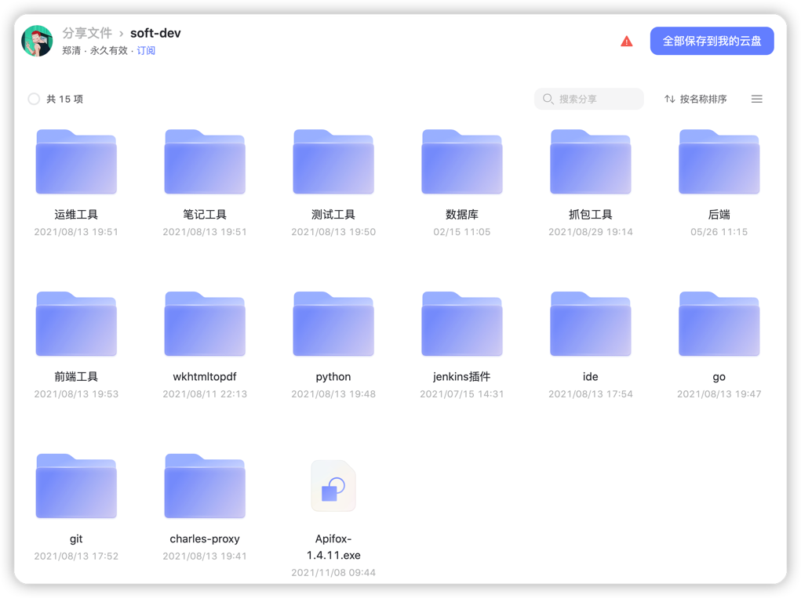

> 每天学习一点点，慢慢日积月累，你总会成为你喜欢的样子，加油。

> https://gitee.com/zhengqingya/java-developer-document

# Java开发者文档

分享日常学习的一些小知识点。
前端，后端，测试，运维等。

### 一、知识库

概览

- [Git](./知识库/Git)
- [Go](./知识库/Go)
- [Java](./知识库/Java)
  - [环境搭建](./知识库/Java/01-环境)
    - [JDK](./知识库/Java/01-环境/01-JDK)
    - [Maven](./知识库/Java/01-环境/02-Maven)
    - [Gradle](./知识库/Java/01-环境/03-Gradle)
    - [Groovy](./知识库/Java/01-环境/04-Groovy)
    - [IDEA](./知识库/Java/01-环境/05-IDEA)
    - [maven-mvnd](./知识库/Java/01-环境/06-maven-mvnd)
  - [基础](./知识库/Java/02-基础)
    - [基础语法](./知识库/Java/02-基础/01-基础语法)
    - [判断语句](./知识库/Java/02-基础/02-判断语句)
    - [循环语句](./知识库/Java/02-基础/03-循环语句)
  - [Maven](./知识库/Java/03-Maven)
  - [Gradle](./知识库/Java/04-Gradle)
  - [Groovy](./知识库/Java/05-Groovy)
  - [多线程](./知识库/Java/06-多线程)
  - [JUC并发编程](./知识库/Java/07-JUC并发编程)
  - [中间件工具](./知识库/Java/09-中间件工具)
  - [JVM](./知识库/Java/11-JVM)
  - [Netty](./知识库/Java/15-Netty)
- [Mac](./知识库/Mac)
- [OTHER](./知识库/OTHER)
- [Python](./知识库/Python)
  - [环境搭建](./知识库/Python/01-环境)
    - [解释器](./知识库/Python/01-环境/01-解释器)
    - [IDE](./知识库/Python/01-环境/02-IDE工具)
    - [Conda](./知识库/Python/01-环境/03-其它/Conda)
    - [Poetry](./知识库/Python/01-环境/03-其它/Poetry)
  - [基础](./知识库/Python/02-基础)
    - [基础语法](./知识库/Python/02-基础/01-基础语法)
    - [判断语句](./知识库/Python/02-基础/02-判断语句)
    - [循环语句](./知识库/Python/02-基础/03-循环语句)
    - [函数](./知识库/Python/02-基础/04-函数)
    - [数据容器](./知识库/Python/02-基础/05-数据容器)
    - [函数进阶](./知识库/Python/02-基础/06-函数进阶)
    - [文件操作](./知识库/Python/02-基础/07-文件操作)
    - [异常、模块、包](./知识库/Python/02-基础/08-异常、模块、包)
    - [综合案例](./知识库/Python/02-基础/09-综合案例)
    - [面向对象](./知识库/Python/02-基础/10-面向对象)
    - [操作MySQL](./知识库/Python/02-基础/11-操作MySQL)
  - [爬虫](./知识库/Python/03-爬虫)
  - [Web](./知识库/Python/04-web)
  - [自动化测试](./知识库/Python/05-自动化测试)
- [前端](./知识库/前端)
  - [环境搭建](./知识库/前端/01-环境)
  - [基础学习](./知识库/前端/02-基础学习)
    - [HTML](./知识库/前端/02-基础学习/01-HTML)
    - [CSS](./知识库/前端/02-基础学习/02-CSS)
    - [TypeScript](./知识库/前端/02-基础学习/03-TypeScript)
    - [Vue3](./知识库/前端/02-基础学习/04-Vue3)
    - [Vue-Router](./知识库/前端/02-基础学习/05-Vue-Router)
    - [Vuex](./知识库/前端/02-基础学习/06-Vuex)
    - [Threejs](./知识库/前端/02-基础学习/07-Threejs)
    - [React](./知识库/前端/02-基础学习/08-React)
  - [☆实战项目☆](./知识库/前端/03-☆实战项目☆)
    - [web项目实战](./知识库/前端/03-☆实战项目☆/web项目实战)
    - [小程序开发](./知识库/前端/03-☆实战项目☆/小程序开发)
    - [h5开发](./知识库/前端/03-☆实战项目☆/h5开发)
    - [抖音小程序](./知识库/前端/03-☆实战项目☆/抖音小程序)
  - [微信小程序](./知识库/前端/05-微信小程序)
  - [Electron桌面应用](./知识库/前端/08-Electron桌面应用)
- [数据库](./知识库/数据库)
  - [Couchbase](./知识库/数据库/Couchbase)
  - [MongoDB](./知识库/数据库/MongoDB)
  - [MySQL](./知识库/数据库/MySQL)
  - [Navicat](./知识库/数据库/Navicat)
  - [Oracle](./知识库/数据库/Oracle)
  - [PostgreSQL](./知识库/数据库/PostgreSQL)
  - [Redis](./知识库/数据库/Redis)
  - [TiDB](./知识库/数据库/TiDB)
- [测试](./知识库/测试)
  - [JMeter](./知识库/测试/JMeter)
  - [Apache-ab](./知识库/测试/Apache-ab.md)
  - [ContiPerf](./知识库/测试/ContiPerf.md)
  - [Locust](./知识库/测试/Locust.md)
  - [Selenium](./知识库/测试/Selenium.md)
- [算法](./知识库/算法)
- [网络安全](./知识库/网络安全)
  - [kali渗透](./知识库/网络安全/kali渗透)
- [业务](./知识库/业务)
- [计算机网络](./知识库/计算机网络)
- [运维](./知识库/运维)
  - [Charles](./知识库/运维/Charles)
  - [Jenkins](./知识库/运维/Jenkins)
  - [JumpServer](./知识库/运维/JumpServer)
  - [k8s](./知识库/运维/k8s)
    - [基础](./知识库/运维/k8s/01-基础)
    - [工具](./知识库/运维/k8s/02-工具)
      - [Kuboard](./知识库/运维/k8s/02-工具/01-Kuboard)
      - [KubeSphere](./知识库/运维/k8s/02-工具/02-KubeSphere)
      - [KubeOperator](./知识库/运维/k8s/02-工具/03-KubeOperator)
      - [Rancher](./知识库/运维/k8s/02-工具/04-Rancher)
  - [Linux](./知识库/运维/Linux)
  - [Nginx](./知识库/运维/Nginx)
  - [Windows](./知识库/运维/Windows)
  - [内网穿透](./知识库/运维/内网穿透)
  - [虚拟机](./知识库/运维/虚拟机)
  - [其它](./知识库/运维/其它)

### 二、开发环境

阿里云盘链接：https://www.aliyundrive.com/s/JZAFEwfUUC1

> tips: 阿里云盘分享目前存在bug，分享的部分文件可能无权限查看和下载

### 三、Other Tools

mysql、redis、mq等可通过`docker-compose`安装 https://gitee.com/zhengqingya/docker-compose

