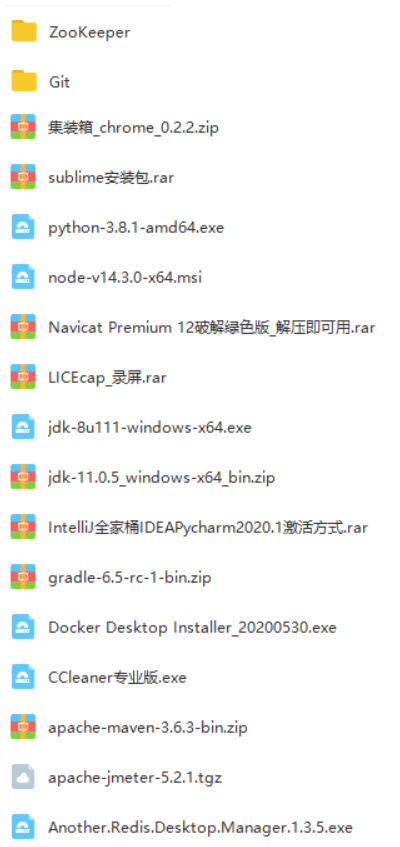
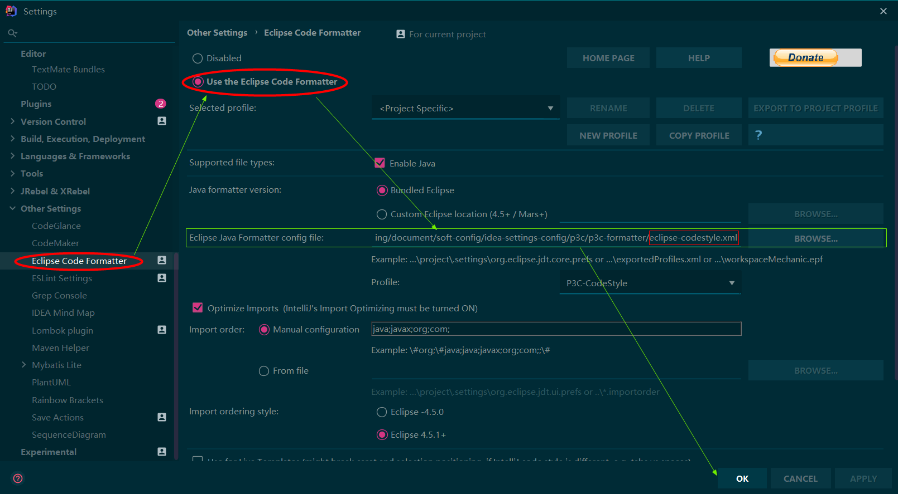

# java-developer-document

## 开发环境

> Java开发环境系列分享链接：https://pan.baidu.com/s/1jIB_5E-1g3_XrMSloF88YA  提取码：8xa5
> 

### Windows10专业版

[点击下载盘云装机助手](https://www.panyun.com/)

激活:

```shell script
# “以管理员身份”运行cmd

# "已成功卸载了产品密钥”
slmgr.vbs /upk

# “成功的安装了产品密钥”
slmgr /ipk W269N-WFGWX-YVC9B-4J6C9-T83GX

# “密钥管理服务计算机名成功的设置为zh.us.to”
slmgr /skms zh.us.to

# “成功的激活了产品”
slmgr /ato
```

### 谷歌插件

[点击下载集装箱](http://one.newday.me/)

### Docker

1. [点击下载Docker Desktop](https://hub.docker.com/?overlay=onboarding)
2. [点击查看安装教程](https://zhengqing.blog.csdn.net/article/details/103441358)

### Git

1. [点击下载Git](https://git-scm.com/downloads)
2. [点击下载TortoiseGit](https://tortoisegit.org/download/)
3. [Git安装教程](https://zhengqing.blog.csdn.net/article/details/86213813)
4. [TortoiseGit安装教程](https://zhengqing.blog.csdn.net/article/details/86220668)

### JDK

1. [点击下载JDK8](https://www.oracle.com/java/technologies/javase/javase-jdk8-downloads.html)
2. [点击查看安装教程](https://zhengqing.blog.csdn.net/article/details/81361749)
3. [点击查看环境变量配置](https://zhengqing.blog.csdn.net/article/details/80492944)

### Apache Maven

1. [点击下载Apache Maven](http://maven.apache.org/download.cgi)
2. [点击查看安装与配置](https://zhengqing.blog.csdn.net/article/details/83956373)

### Gradle

[点击下载Gradle](https://services.gradle.org/distributions/)

### IntelliJ IDEA

[点击下载IDEA](https://www.jetbrains.com/idea/download/#section=windows)

---

### Node.js

[点击下载](https://nodejs.org/zh-cn/download/)

### Visual Studio Code

[点击下载](https://code.visualstudio.com/)

### Python

1. [点击下载解释器](https://www.python.org/getit/)
2. [点击查看解释器安装教程](https://zhengqing.blog.csdn.net/article/details/81464255)
3. [点击查看PyCharm安装教程](https://zhengqing.blog.csdn.net/article/details/104180344)

### FinalShell

[点击下载](http://www.hostbuf.com/t/988.html)

### Everything

[点击下载](https://www.voidtools.com/zh-cn/downloads/)

### 微信开发者工具

[点击下载](https://developers.weixin.qq.com/miniprogram/dev/devtools/download.html)

### HBuilderX

[点击下载](https://www.dcloud.io/)

### Other Tools

[mysql、redis、mq等可通过`docker-compose`直接安装，点击进入查看详情](https://gitee.com/zhengqingya/docker-compose)


---


## 开发规范

### IDEA插件

> 这里根据自己的情况来选择安装即可

| 是否必装                      | 插件名称                       | 插件介绍                                                     |
| ------------------------------ | ------------------------------ | ------------------------------------------------------------ |
| √ | Alibaba Java Coding Guidelines | 阿里巴巴出的代码规范检查插件                                 |
| √ | Eclipse Code Formatter | 阿里代码规范code style所需                             |
| √ | Save Actions  | 保存时的一些自动操作，如按下Ctrl + S 即可自动按照阿里巴巴编码风格格式化代码                           |
| √ | Lombok                      | 类上注解@Data省去getter/setter、toString等方法滴                                 |
|  | JRebel                   | 热部署滴 快捷键：Ctrl+F9                                     |
|  | Free Mybatis plugin              | 在 Mybatis 的 mapper Java 接口方法和 mapper XML 文件之间来回切换                             |
|  | MyBatis Log Plugin                       | Mybatis运行后的相关sql日志可转换成sql语句直接输出在console中                                  |
|  | CodeGlance                     | 类似SublimeText的Mini Map插件，一个代码编辑区缩略图插件，可以快速定位代码                         |
|  | CamelCase                     | 命名风格转换插件，可以在 kebab_case，SNAKE_CASE，PascalCase，camelCase，snake_case 和 空格风格之间切换。快捷键苹果为 ⇧+⌥+ U ，windows 下为 Shift + Alt +U                         |
|  | RestfulToolkit              | 一套 RESTful 服务开发辅助工具集，可根据url定位controller                              |
|  | Grep Console                   | 自定义设置控制台输出颜色,显示不同日志信息级别的颜色和背景色                                     |
|  | .ignore                        | 各类版本控制忽略文件生成工具                                 |
|  | GenerateAllSetter                       |     生成对象set方法                         |


### 代码规范 Code Style

###### Google

1. 下载[intellij-java-google-style.xml](https://github.com/google/styleguide/blob/gh-pages/intellij-java-google-style.xml)
2. 


###### 阿里

> 需`Eclipse Code Formatter`插件

1. 下载[eclipse-codestyle.xml](https://github.com/alibaba/p3c/tree/master/p3c-formatter)
2. 

### 阿里巴巴Java开发手册

[点击下载](https://github.com/alibaba/p3c/blob/master/%E9%98%BF%E9%87%8C%E5%B7%B4%E5%B7%B4Java%E5%BC%80%E5%8F%91%E6%89%8B%E5%86%8C%EF%BC%88%E6%B3%B0%E5%B1%B1%E7%89%88%EF%BC%89.pdf)


### 自动格式化代码`Ctrl + S`

> 需`Save Actions`插件


