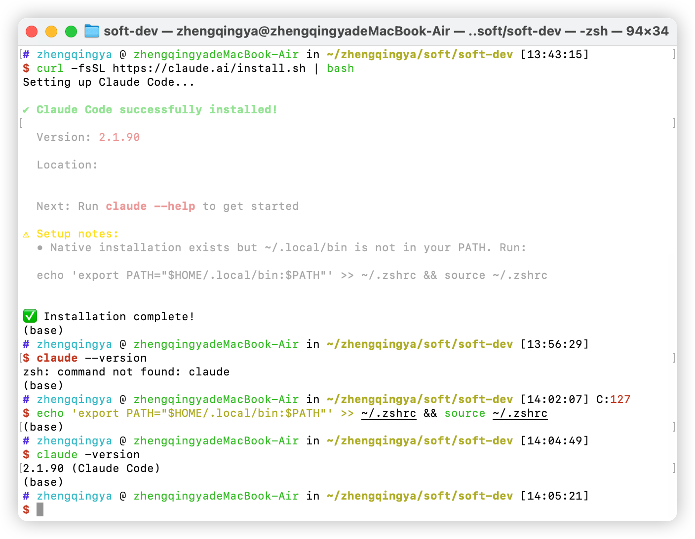

### 安装

> https://claude.com/product/claude-code

```shell
# 安装
curl -fsSL https://claude.ai/install.sh | bash

# 将该路径添加到环境变量并立即生效
echo 'export PATH="$HOME/.local/bin:$PATH"' >> ~/.zshrc && source ~/.zshrc

# 验证
claude -version
```



