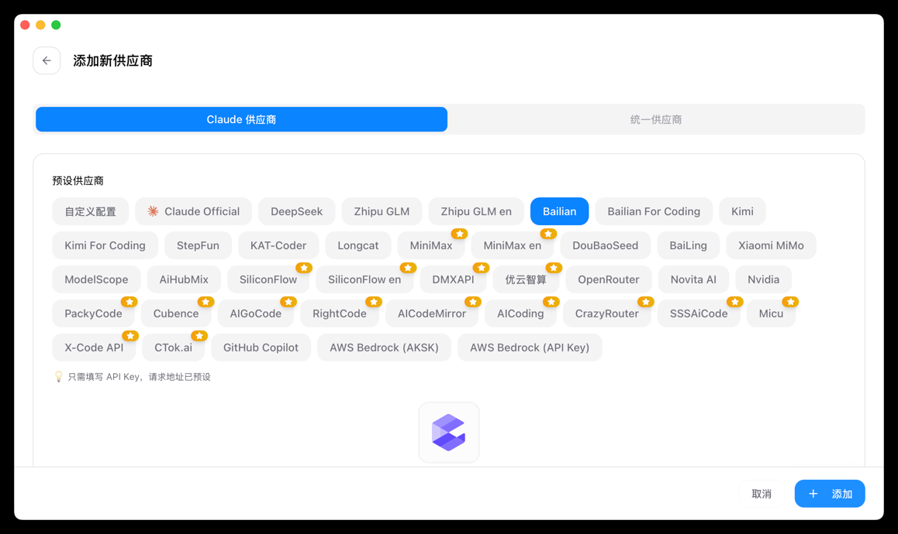
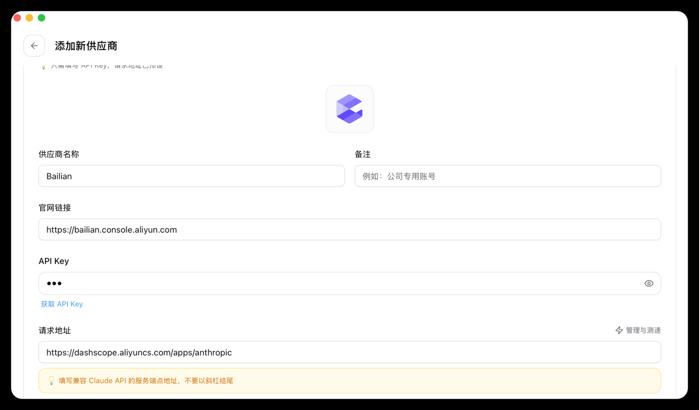
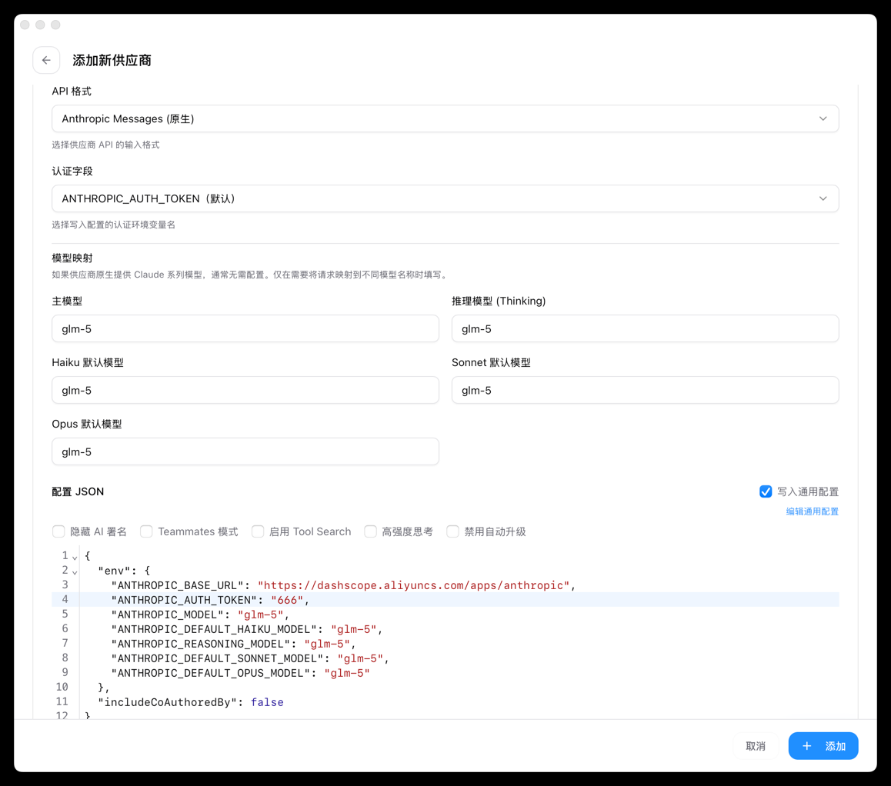
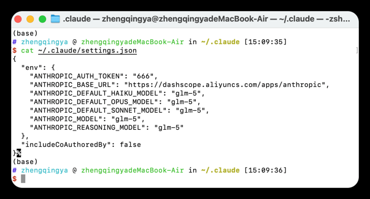

### 模型配置 cc-switch

https://github.com/farion1231/cc-switch/

cc-switch：一款适用于 Claude Code、Codex、OpenCode、openclaw 和 Gemini CLI 的跨平台桌面一体化助手工具。

安装后添加服务商，eg：阿里云百炼




最终claude配置查看

```shell
cat ~/.claude/settings.json
```



