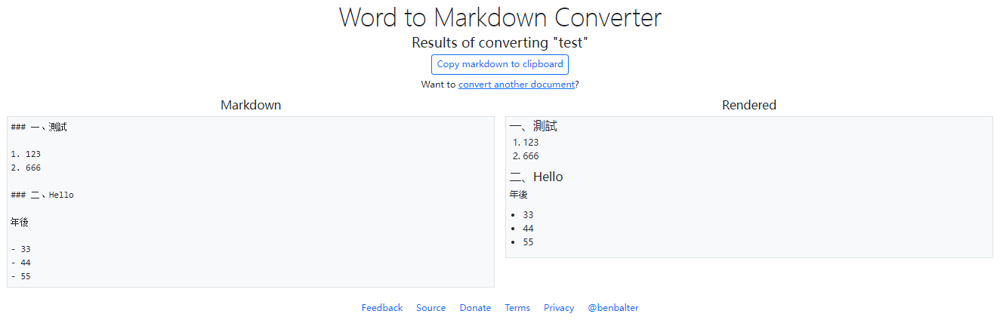

# word转markdown

### 一、离线转换 Writage

下载&安装  https://www.writage.com/

> tips: 这个工具网上说的是word另存为的时候会多出一个保存markdown格式的选项，但是我这里没有...

### 二、Pandoc

Pandoc是一个强大的文档转换工具，支持多种格式之间的转换，包括从Word到Markdown。它是一个命令行工具，可在Windows、Mac和Linux上使用。

下载&安装 https://github.com/jgm/pandoc/releases/download/3.1.4/pandoc-3.1.4-windows-x86_64.msi

在默认安装路径 `C:\Users\zhengqingya\AppData\Local\Pandoc` 下执行转换命令

```shell
pandoc -f docx -t markdown --extract-media ./images -o test.md test.docx
```

> tips: 个人试了下感觉还是挺强的，但格式还是有点问题，应该是word格式本身就有点问题导致的...

### 三、在线转换 https://word2md.com/

文件大了之后，就不太行...



### 四、Typora

- word -> html -> CV到Typora中
- 也可以直接在Typora中导入word
- 打开word -> CV到Typora中

但效果都不太好...
