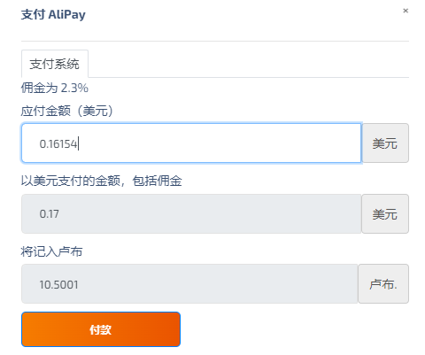
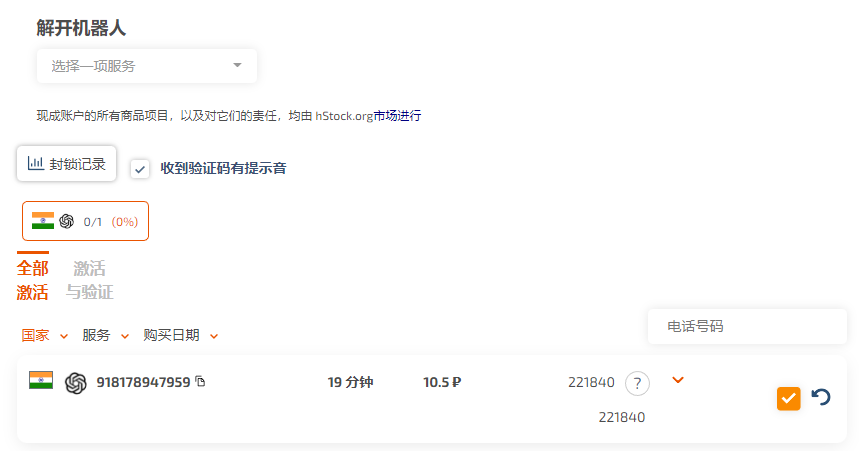

# Chat GPT

https://chat.openai.com

国内免费体验：

- https://gpt.chatapi.art
- https://chat.bygpt.com

###### 注册

国外免费临时手机号 https://sms-activate.org/cn (这个需1.19块钱 输入0.16154美元得到10.5001卢布)

如果收不到短信可以x掉重新来

- 注册openAI账号 https://openai.com/api
- 体验效果 https://chat.openai.com/chat

### VSCode插件

#### ChatGPT中文版

### 谷歌插件

#### ChatGPT for Google

- https://github.com/wong2/chat-gpt-google-extension
- https://chrome.google.com/webstore/detail/chatgpt-for-google/jgjaeacdkonaoafenlfkkkmbaopkbilf

在Google搜索内容时会在右侧展示 ChatGPT 反馈结果，进一步提升搜索效率。

#### ChatGPT Chrome Extension

https://github.com/gragland/chatgpt-chrome-extension

在任意页面文本框中点击右键，即可弹出「Ask ChatGPT」的选项。

### 其它

#### 逆向工程

https://github.com/acheong08/ChatGPT

提取API =>  自行开发一款好玩的聊天机器人、AI 智能助手、代码辅助工具等应用。

#### ChatGPT for desktop

https://github.com/vincelwt/chatgpt-mac

可通过 `Cmd+Shift+G` 快捷键，快速在系统菜单栏启动 ChatGPT。

#### 微信聊天助手

- `WeChat GPT` https://github.com/fuergaosi233/wechat-chatgpt
- `ChatGPT WeChat Bot` https://github.com/AutumnWhj/ChatGPT-wechat-bot

基于 wechaty 来建立微信与 ChatGPT 的桥梁，让你快速通过微信聊天窗口，发起与 ChatGPT 的对话。

#### Mac

https://github.com/vincelwt/chatgpt-mac