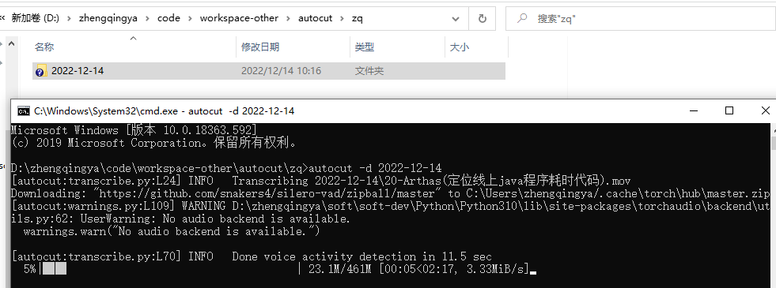
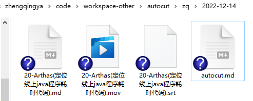
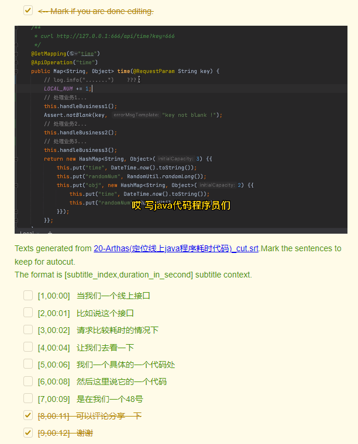
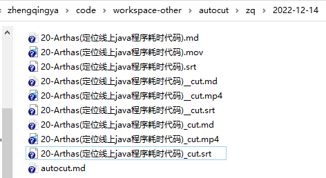

# AutoCut

> https://github.com/mli/autocut

通过字幕来剪切视频

### 安装

先安装[FFmpeg](06-FFmpeg.md)

```shell
pip install git+https://github.com/mli/autocut.git
```

###### mac安装问题解决

> 暂未解决...

```
  × git clone --filter=blob:none --quiet https://github.com/openai/whisper.git /private/var/folders/7m/bp0c0psx6j7gv6h0fzsknv200000gn/T/pip-install-6uk6speh/whisper_755be6b9bde24cfb831eceb1eea96c70 did not run successfully.
  │ exit code: 128
  ╰─> See above for output.
  
  note: This error originates from a subprocess, and is likely not a problem with pip.
error: subprocess-exited-with-error

× git clone --filter=blob:none --quiet https://github.com/openai/whisper.git /private/var/folders/7m/bp0c0psx6j7gv6h0fzsknv200000gn/T/pip-install-6uk6speh/whisper_755be6b9bde24cfb831eceb1eea96c70 did not run successfully.
│ exit code: 128
╰─> See above for output.
```

### 使用

```shell
autocut -d 2022-12-14
```



等待一会儿之后会生成如下文件



- xxx.mov
- xxx.srt
- xxx.md
- autocut.md

勾选需要的语句之后再勾选`Mark if you are done editing.` 即可自动剪辑出新的视频`xxx_cut.mp4`


