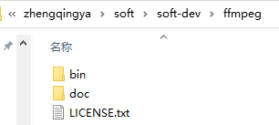
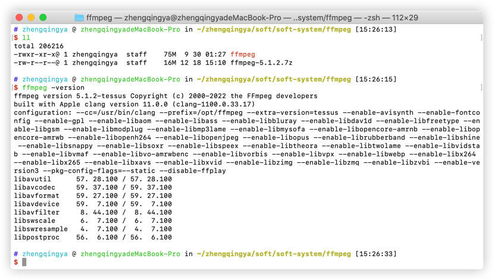

# FFmpeg

https://ffmpeg.org

### 下载

https://github.com/BtbN/FFmpeg-Builds/releases



### 配置环境变量

#### Windows

> `此电脑` -> `属性` -> `高级系统设置` -> `环境变量`

```
# 编辑PATH环境变量，新增
D:\zhengqingya\soft\soft-dev\ffmpeg\bin
```

```shell
# 查看版本
ffmpeg -version
```

#### Mac

```shell
# 配置环境变量
open ~/.bash_profile
```

新增如下配置

```shell
############################# ↓↓↓↓↓↓ set ffmpeg environment ↓↓↓↓↓↓ #############################
FFMPEG_HOME=/zhengqingya/soft/soft-system/ffmpeg
PATH=$PATH:$FFMPEG_HOME
export FFMPEG_HOME PATH
################################################################################################
```

```shell
# 使配置生效
source ~/.bash_profile

# 验证
ffmpeg -version
```

