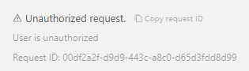
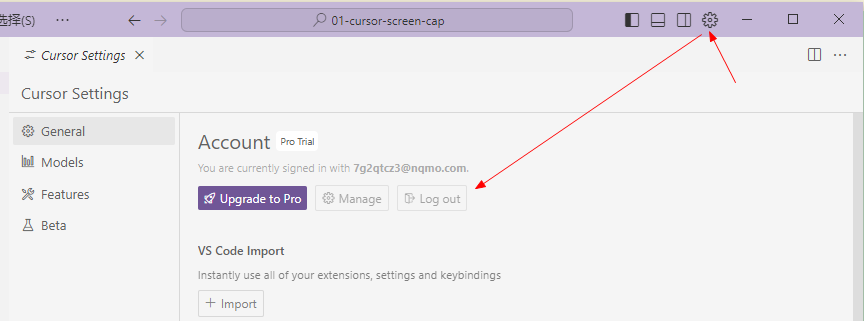
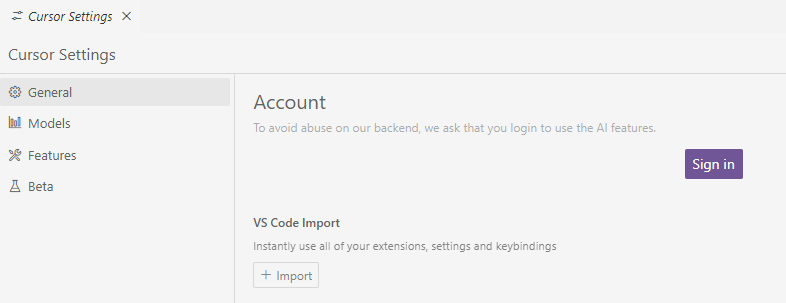
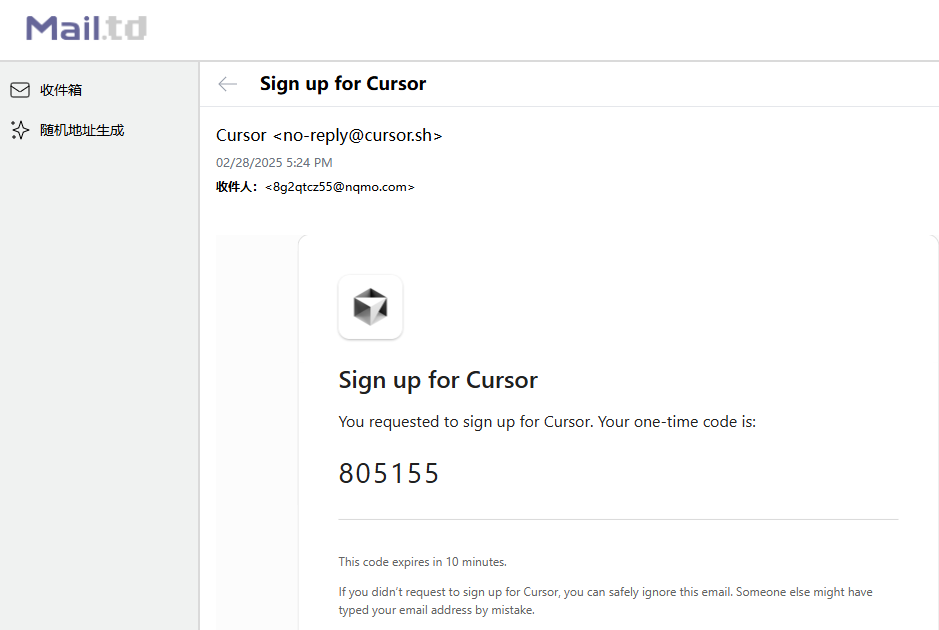
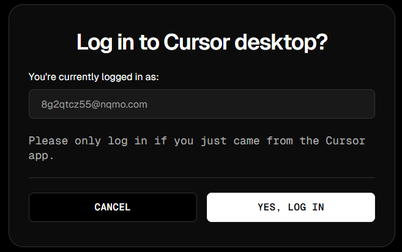
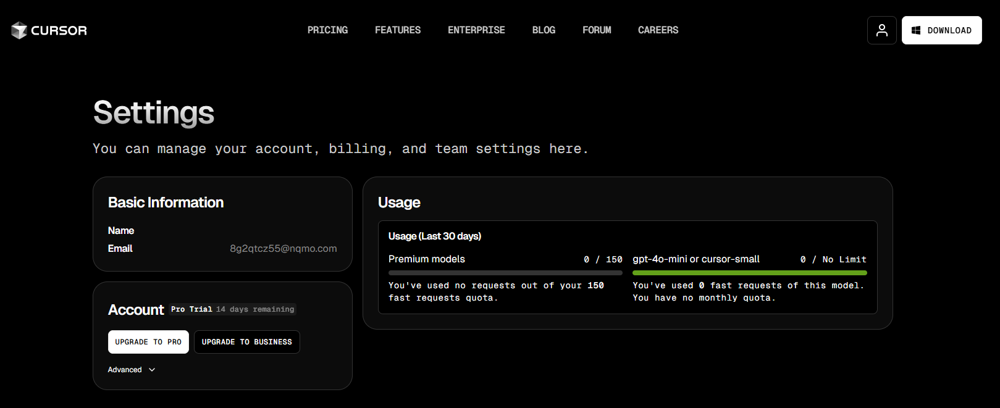

# cursor-free-vip

https://github.com/yeongpin/cursor-free-vip

> 下面是旧版，不用看了。

---

#### 1、重置机器码

问题：Cursor会检测设备机器码，频繁更换账号导致使用限制。


解决：重置机器码。

使用见：https://github.com/fly8888/cursor_machine_id

```shell
git clone https://github.com/fly8888/cursor_machine_id.git
cd cursor_machine_id
python change_cursor_id.py
```

#### 2、cursor编辑器退出登录，关闭，重新打开登录





#### 3、临时邮箱 接收验证码 再次登录

> tips: 使用标准邮箱`@gmail.com`，目前部分临时邮箱虽然正常注册，但是无法正常使用cursor...

使用新的邮箱地址注册 -> 继续享受免费次数 ^_^

https://mail.td/zh






