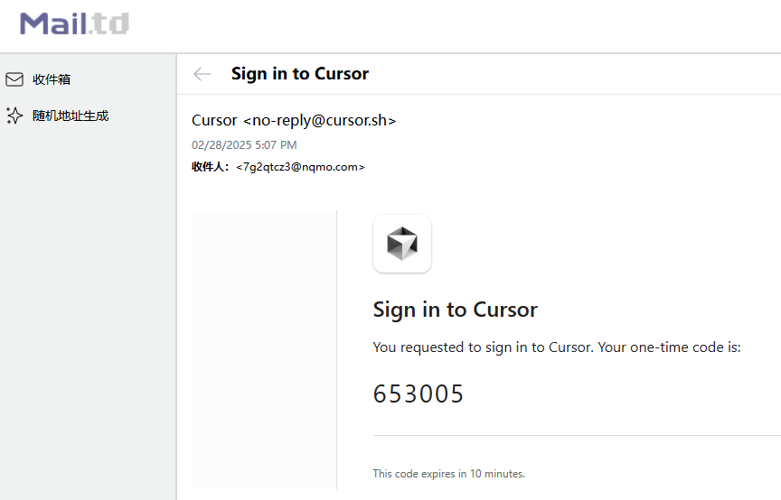
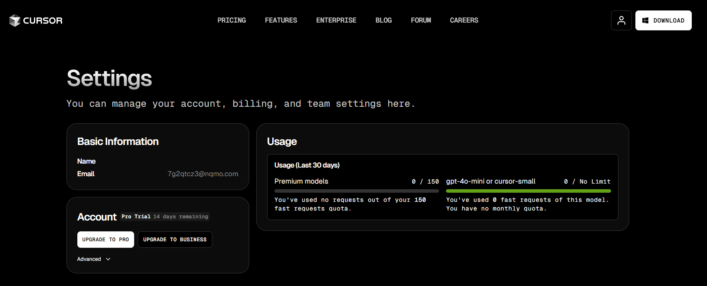

#### 1、cursor编辑器退出登录

#### 2、临时邮箱 接收验证码 再次登录

使用新的邮箱地址注册 -> 继续享受免费次数 ^_^

https://mail.td/zh

#### 3、重置机器码

如果Cursor检测设备机器码，频繁更换账号导致使用限制，可尝试重置机器码。

使用见：https://github.com/fly8888/cursor_machine_id
