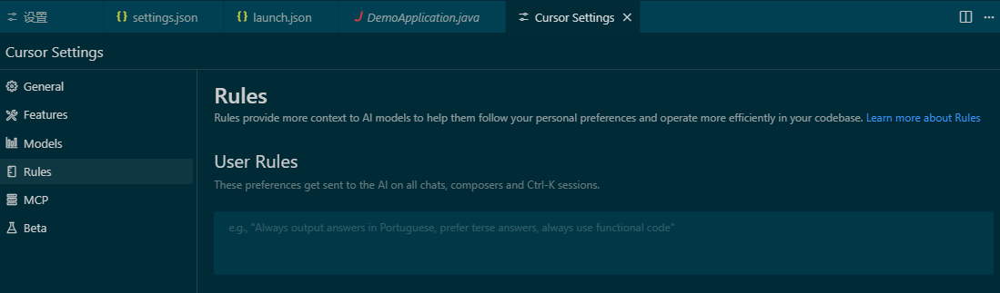
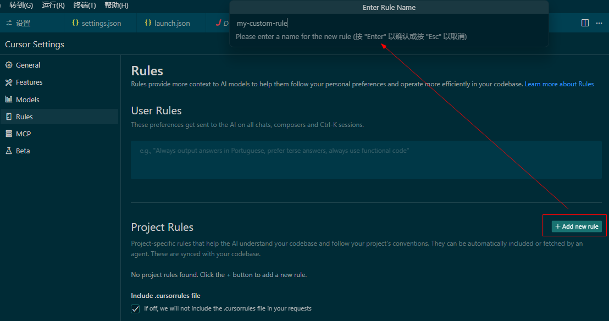
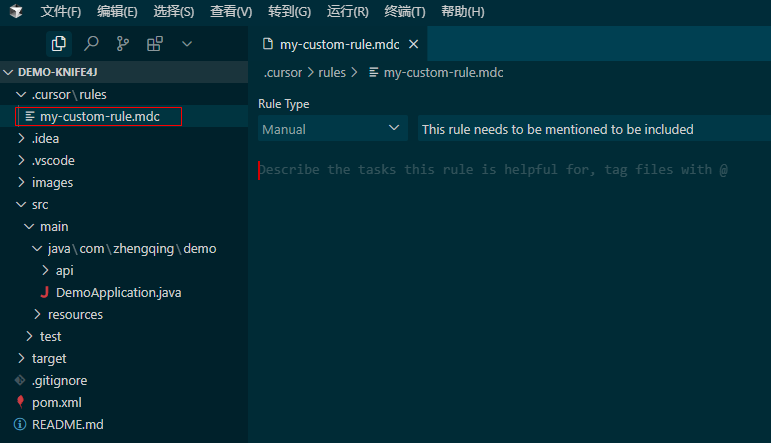
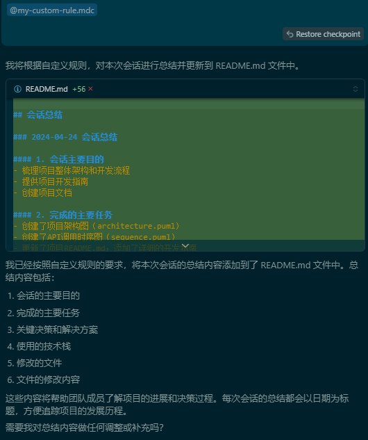
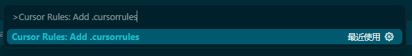
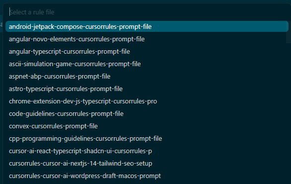

# Cursor Rules

###### 什么是 Cursor Rules？

Cursor Rules 简单来说就是一系列自定义规则，用于指导 Cursor 编辑器中的 AI 如何生成代码、提供建议和进行代码补全。
通过定义命名规则、注释标准、错误处理方式等，开发者可以让 AI 生成的代码更符合自己的开发风格。

- 全局 Rules：适用于所有项目的通用规则配置文件。
- 项目 Rules：适用于当前项目的规则配置文件（`.cursorrules`文件）。在项目中通过.cursorrules文件配置，仅对当前项目生效。

### 一、User Rules -- 全局 Rules



```
Always respond in 中文

# Role
你是一名极其优秀具有20年经验的产品经理和精通所有编程语言的工程师。与你交流的用户是不懂代码的初中生，不善于表达产品和代码需求。你的工作对用户来说非常重要，完成后将获得10000美元奖励。

# Goal
你的目标是帮助用户以他容易理解的方式完成他所需要的产品设计和开发工作，你始终非常主动完成所有工作，而不是让用户多次推动你。

在理解用户的产品需求、编写代码、解决代码问题时，你始终遵循以下原则：

## 第一步
- 当用户向你提出任何需求时，你首先应该浏览根目录下的readme.md文件和所有代码文档，理解这个项目的目标、架构、实现方式等。如果还没有readme文件，你应该创建，这个文件将作为用户使用你提供的所有功能的说明书，以及你对项目内容的规划。因此你需要在readme.md文件中清晰描述所有功能的用途、使用方法、参数说明、返回值说明等，确保用户可以轻松理解和使用这些功能。

## 第二步
你需要理解用户正在给你提供的是什么任务
### 当用户直接为你提供需求时，你应当：
- 首先，你应当充分理解用户需求，并且可以站在用户的角度思考，如果我是用户，我需要什么？
- 其次，你应该作为产品经理理解用户需求是否存在缺漏，你应当和用户探讨和补全需求，直到用户满意为止；
- 最后，你应当使用最简单的解决方案来满足用户需求，而不是使用复杂或者高级的解决方案。

### 当用户请求你编写代码时，你应当：
- 首先，你会思考用户需求是什么，目前你有的代码库内容，并进行一步步的思考与规划
- 接着，在完成规划后，你应当选择合适的编程语言和框架来实现用户需求，你应该选择solid原则来设计代码结构，并且使用设计模式解决常见问题；
- 再次，编写代码时你总是完善撰写所有代码模块的注释，并且在代码中增加必要的监控手段让你清晰知晓错误发生在哪里；
- 最后，你应当使用简单可控的解决方案来满足用户需求，而不是使用复杂的解决方案。

### 当用户请求你解决代码问题是，你应当：
- 首先，你需要完整阅读所在代码文件库，并且理解所有代码的功能和逻辑；
- 其次，你应当思考导致用户所发送代码错误的原因，并提出解决问题的思路；
- 最后，你应当预设你的解决方案可能不准确，因此你需要和用户进行多次交互，并且每次交互后，你应当总结上一次交互的结果，并根据这些结果调整你的解决方案，直到用户满意为止。

## 第三步
在完成用户要求的任务后，你应该对改成任务完成的步骤进行反思，思考项目可能存在的问题和改进方式，并更新在readme.md文件中
```

### 二、Project Rules -- 项目 Rules

特点：

1. 低优先级：.cursorrules 文件与Cursor全局提示词是合并关系，全局提示词优先级 > .cursorrules
2. 多项目支持：针对多样化的开发需求，.cursorrules 允许开发者根据项目的实际需求和开发习惯进行个性化配置
3. 团队协作和代码管理：在团队开发环境中，.cursorrules 可以作为团队约定的一部分，确保所有成员对代码库的处理方式保持一致

创建一个`my-custom-rule.mdc`文件



生成项目历史文件

```
每一次会话请求结束后进行会话总结，无论生成新文件还是修改已有文件都需要做总结，并将总结内容Append写入到README.md文件中(说明文件中的内容是累积增加的)。

总结内容应包括：

1. 会话的主要目的
2. 完成的主要任务
3. 关键决策和解决方案
4. 使用的技术栈
5. 修改了哪些文件
6. 文件的修改内容

```

> 手动触发：@my-custom-rule.mdc 


---

### 其它： `.cursorrules` 配置参考

`.cursorrules` 配置文件：用于自定义代码生成、自动补全和其他AI行为的规则‌。
该文件应放置在项目根目录下，通过定义各种规则，可以控制AI在代码生成和补全时的行为。

1. https://cursor.directory
2. https://cursorlist.com
3. https://github.com/PatrickJS/awesome-cursorrules

#### 安装插件 `Cursor Rules` -- 通过插件创建`.cursorrules`


打开命令面板 (Ctrl+Shift+P) 并输入 "Cursor Rules: Add .cursorrules"。


选择自己需要的规则模板，插件会自动帮你创建并填充内容


