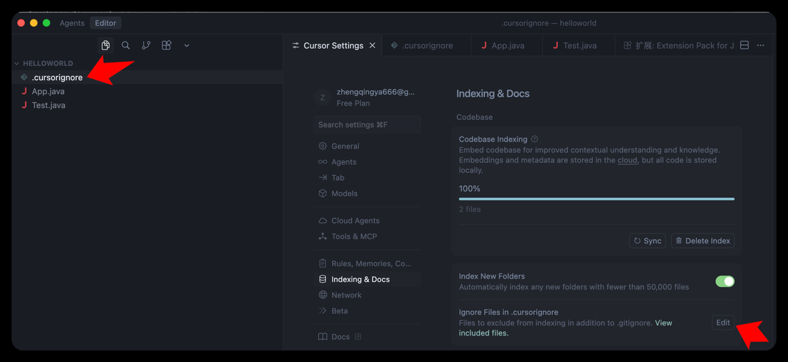

# `.cursorignore` 忽略文件配置

作用：

- **指定需要忽略的文件和目录**：用于告诉 Cursor IDE 哪些文件或目录不应该被索引和处理
- **提高性能**：通过排除不必要的文件（如依赖包、编译输出等），可以加快 IDE 的索引速度和整体性能
- **减少干扰**：避免在代码搜索、自动补全等功能中出现不相关的文件内容



`.cursorignore` 配置示例

```
# Add directories or file patterns to ignore during indexing (e.g. foo/ or *.csv)
node_modules/
target/
.git/
*.iml
```
