# 域名绑定Cloudflare实现无限邮箱

> tips：我的域名是在阿里云购买的，下面是阿里云操作为例。

注册登录Cloudflare
https://dash.cloudflare.com

添加域名
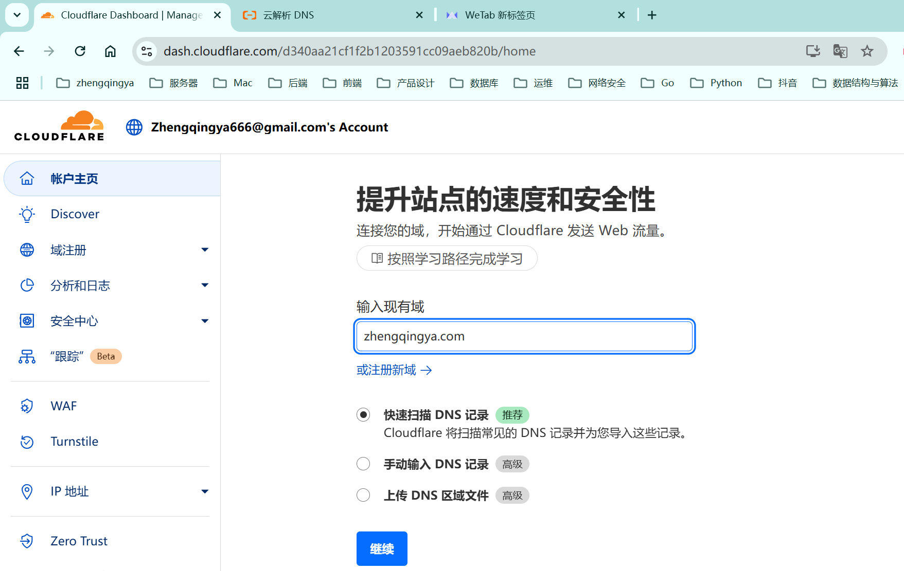

选择第一个Free计划
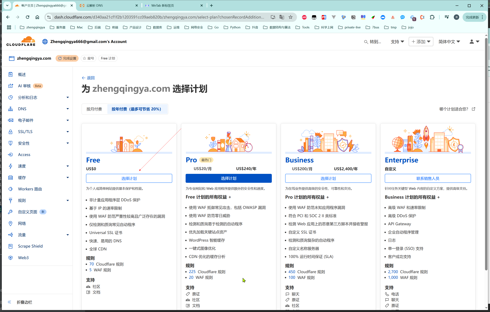

点击前往激活
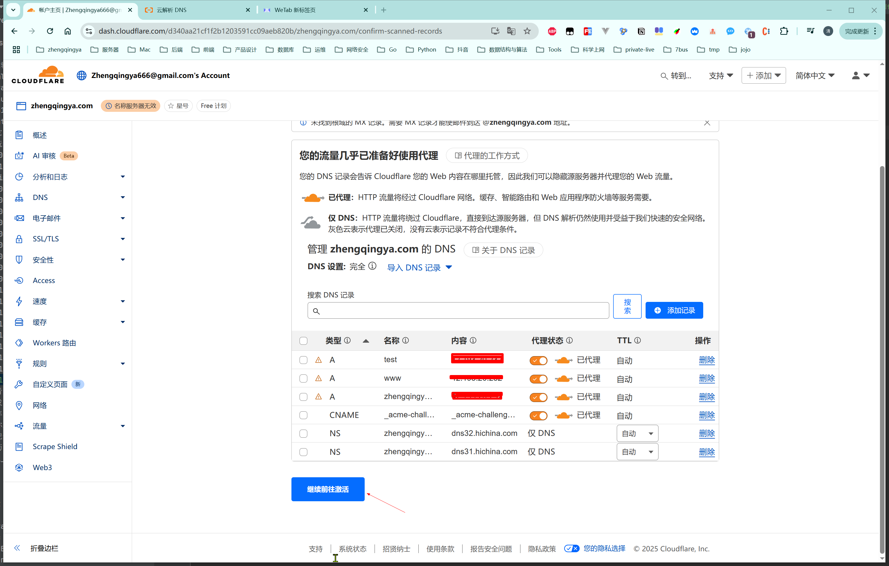

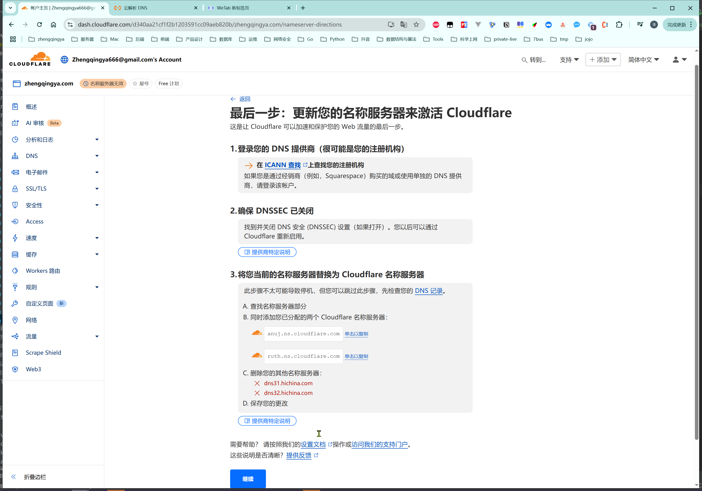

阿里云DNS修改
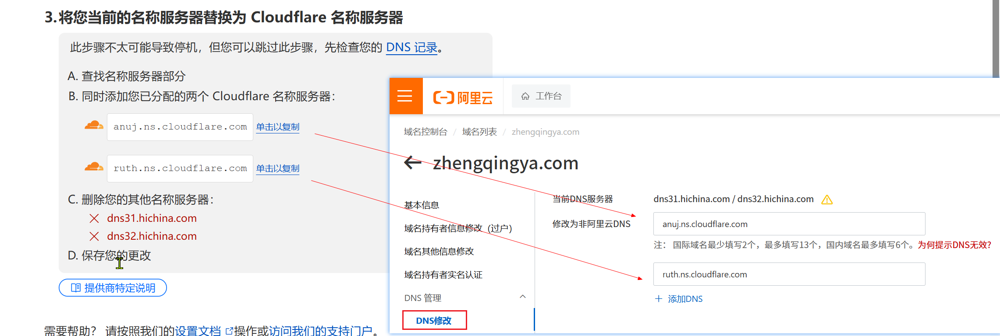
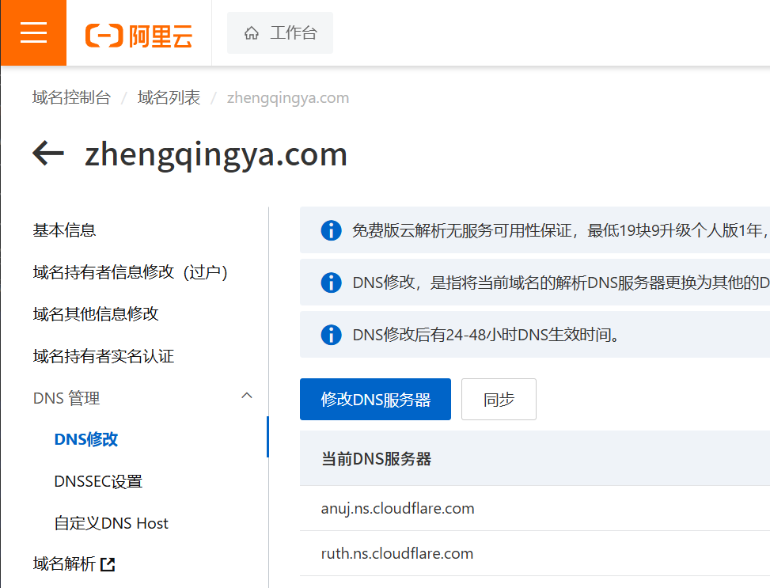
回到Cloudflare，点继续。

再刷新Cloudflare，显示活动状态，说明配置成功。tips: 可能会需要等待一段时间，我这边实操1分钟左右。
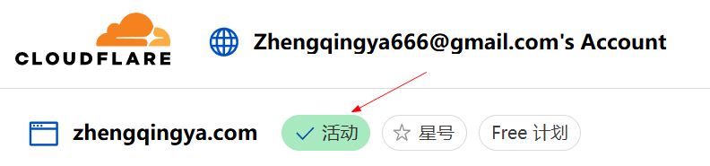

电子邮件 -> 电子邮件路由 -> 开始使用
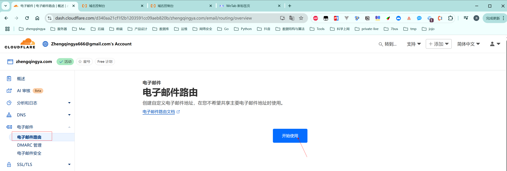

跳过入门指南
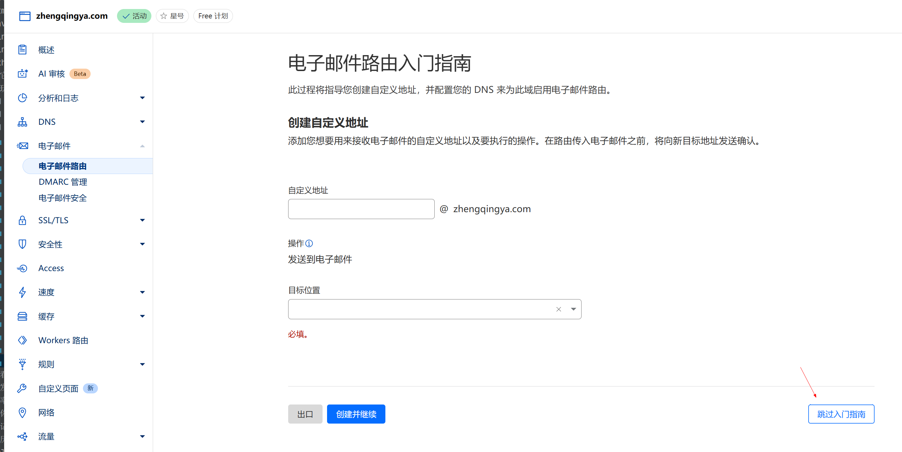

启用电子邮件路由
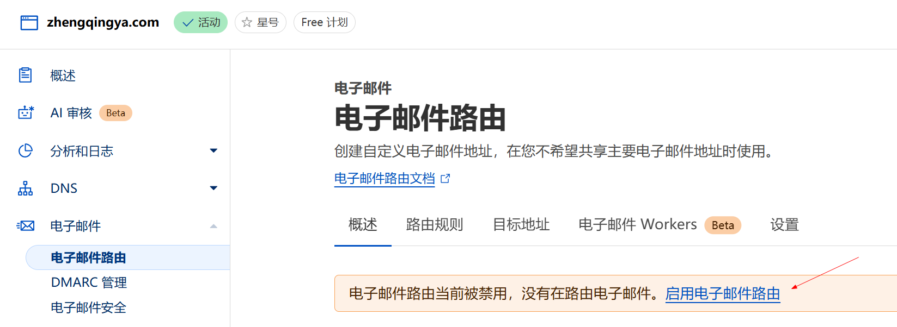
添加记录并启用
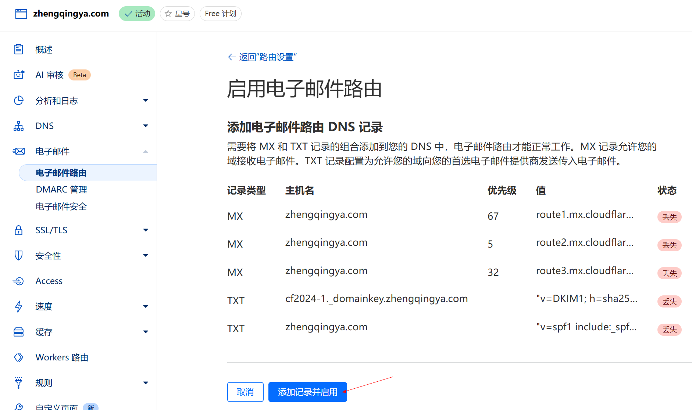

添加目标地址
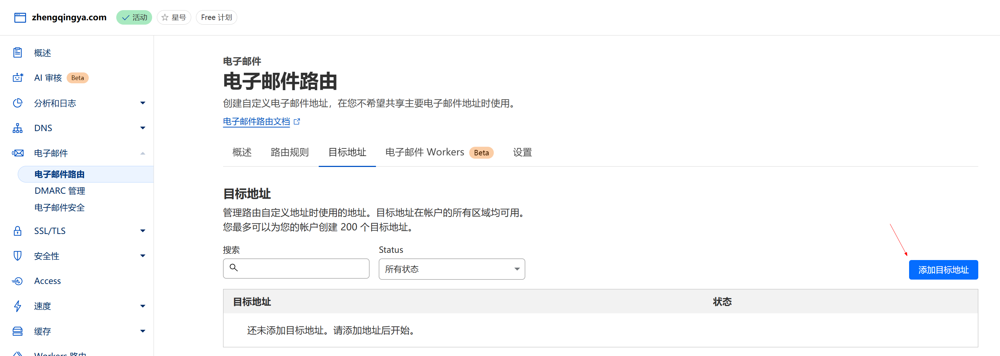
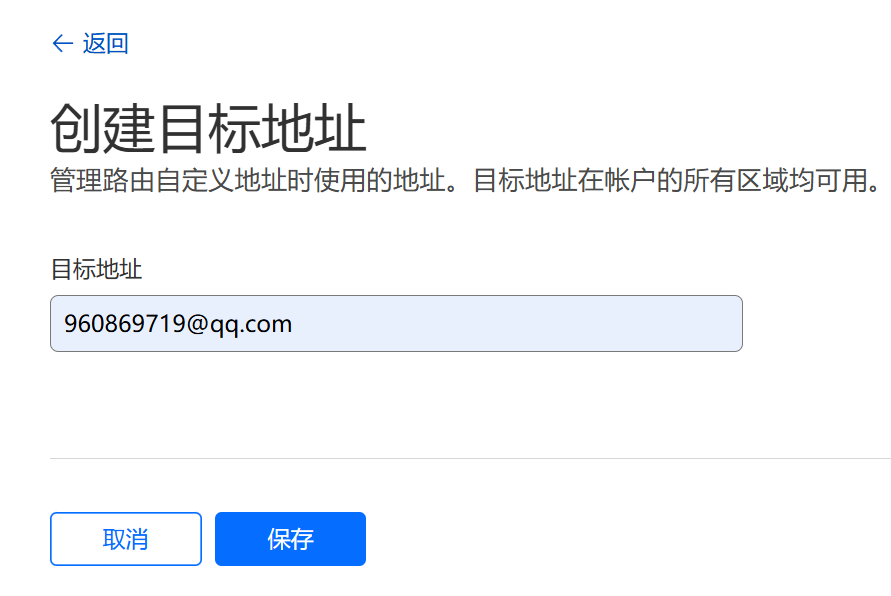

接收邮箱通知 校验即可
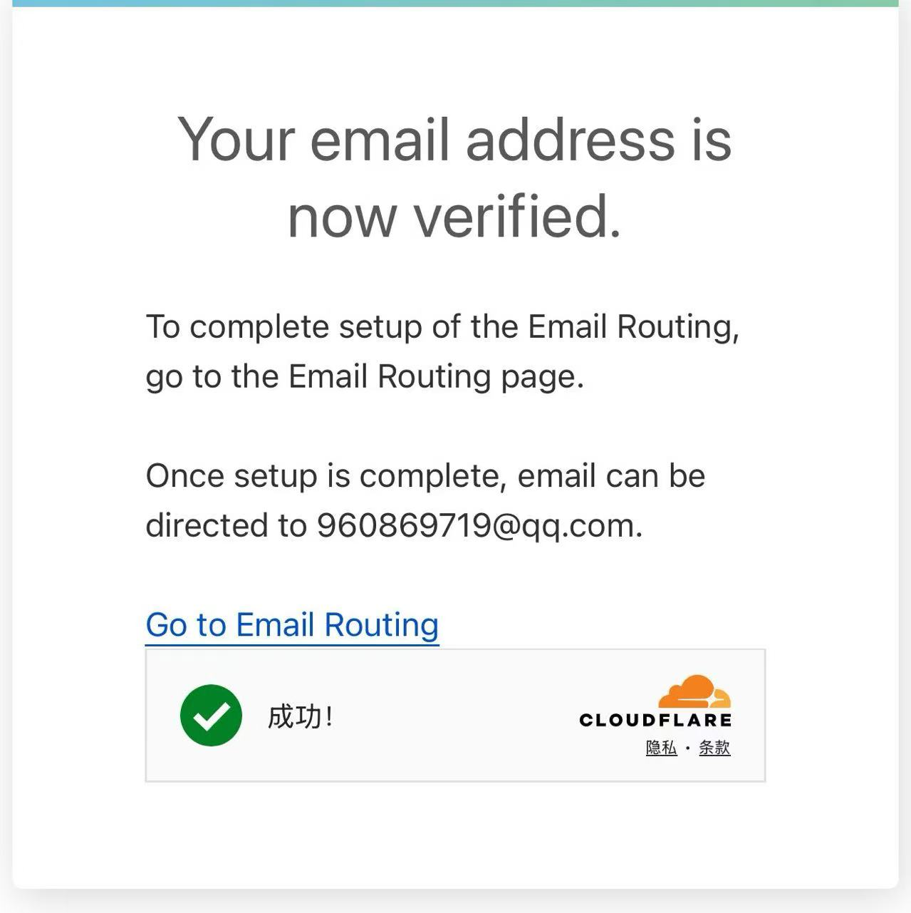
校验之后目标地址状态为变为已验证。
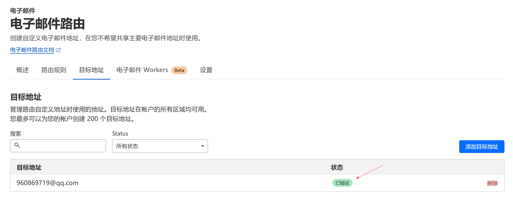

路由规则 -> 编辑
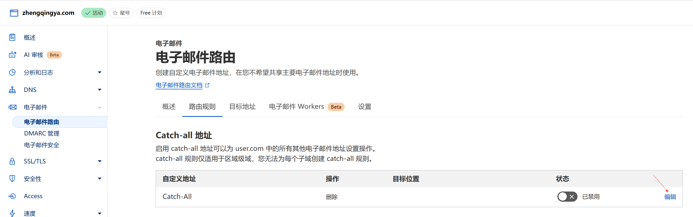
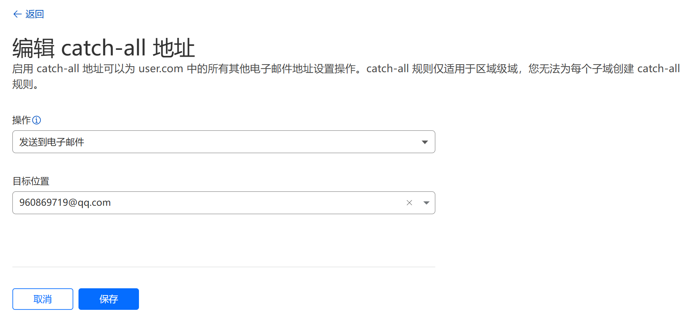
保存之后将状态改成启用。
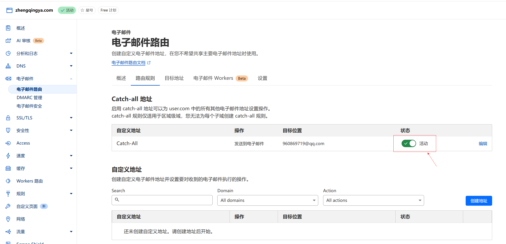

接下来就可以发邮箱测试下了，eg：zq666@zhengqingya.com
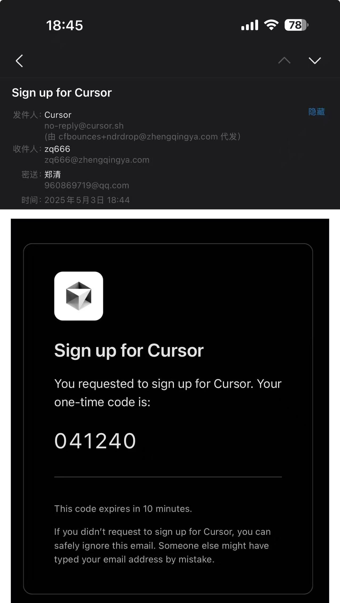

