# Genimi学生认证

> 本教程测试时间：2026年1月30日00:51:39

> Tips: 请按需付费！理性购买！！！

### 一、注册谷歌账号 https://www.google.com

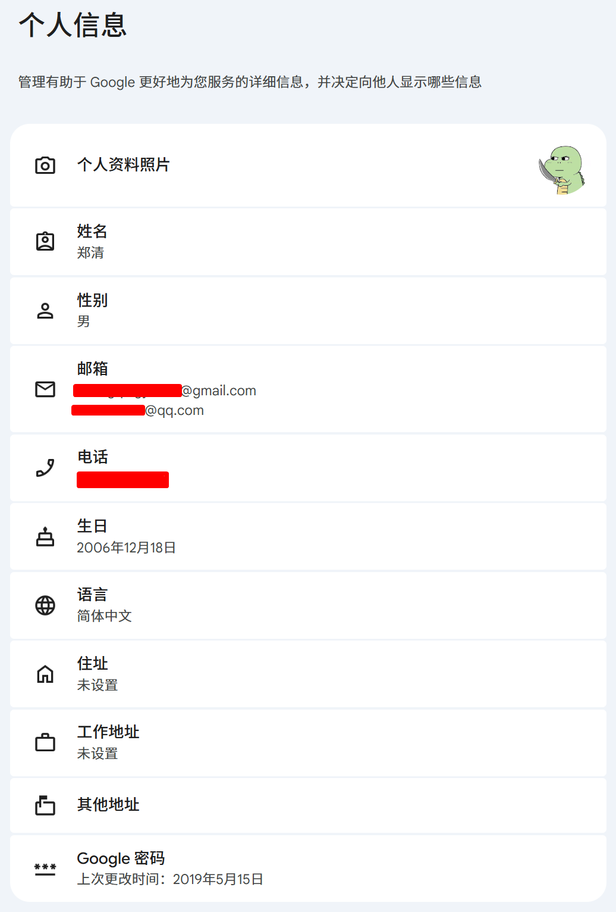

### 二、学生认证

1、进入 https://one.google.com/ai-student 复制链接地址
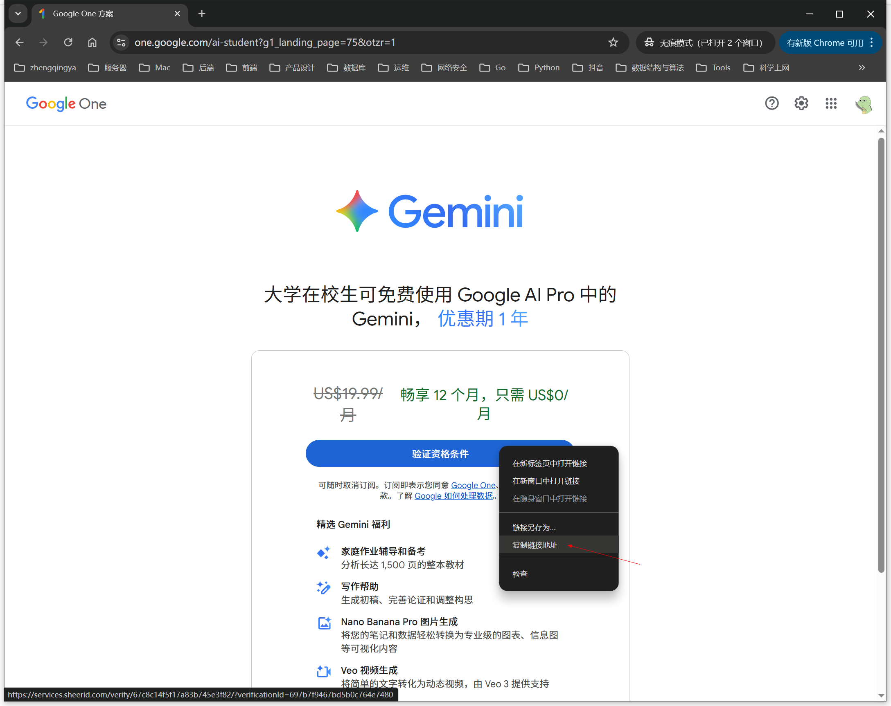

2、进入 https://batch.1key.me/ 自动验证学生身份
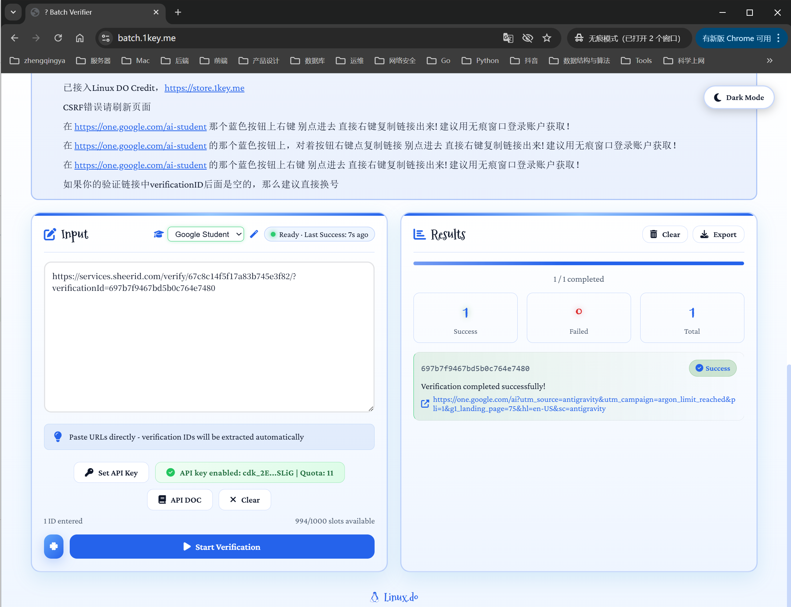

3、回到 https://one.google.com/ai-student 发现按钮文案从 `验证资格条件` 变成了 `畅享学生优惠`
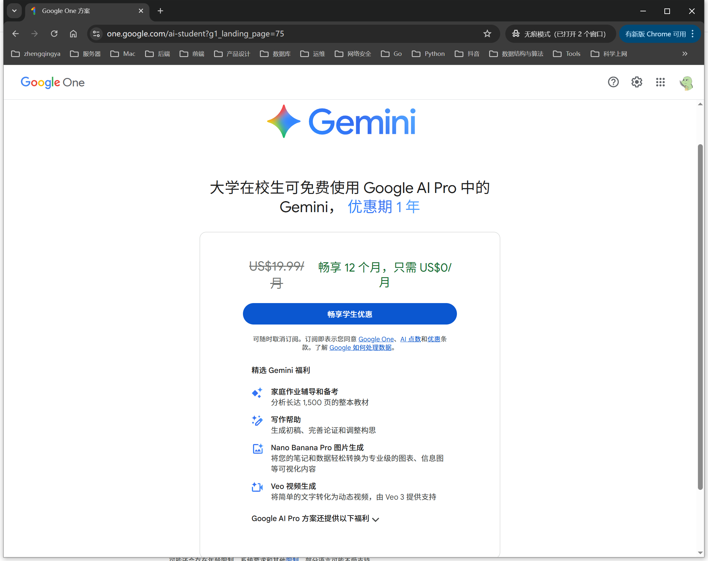

### 三、绑定信用卡

#### 1、获取银行卡信息

> Tips: https://one.idkey.cc/  这个学生认证功能未验证，仅使用了其中的 `Gemini专用订阅卡/Gemini payment card`

a、进入 https://car.kennygmail.com/item?id=95 购买卡密
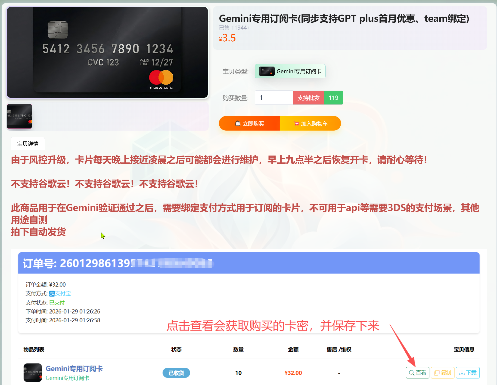

b、拿到卡密
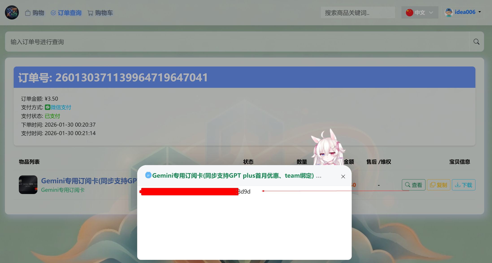

c、进入 https://kaka.kennygmail.com/ 根据卡密激活 -> 拿到银行卡信息
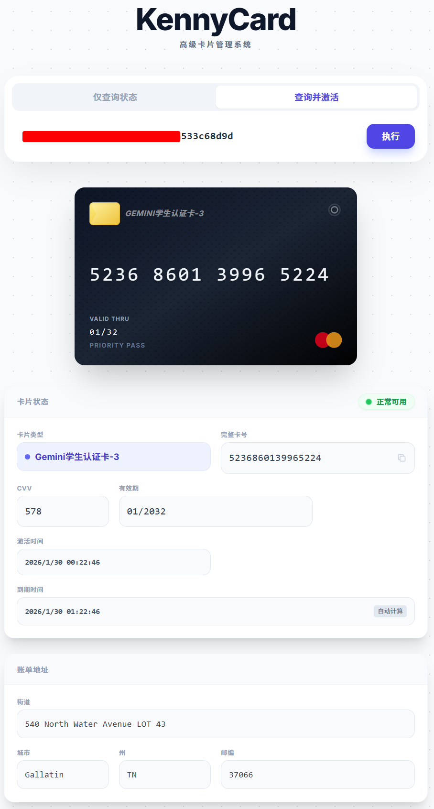

#### 2、谷歌中添加支付方式 https://payments.google.com/gp/w/home/signup

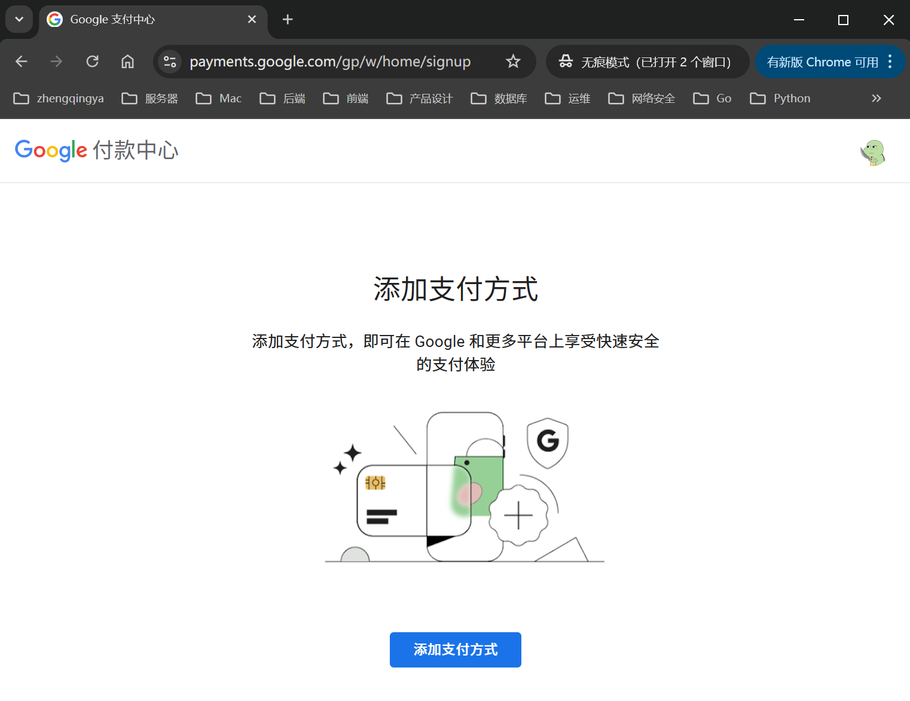

完成
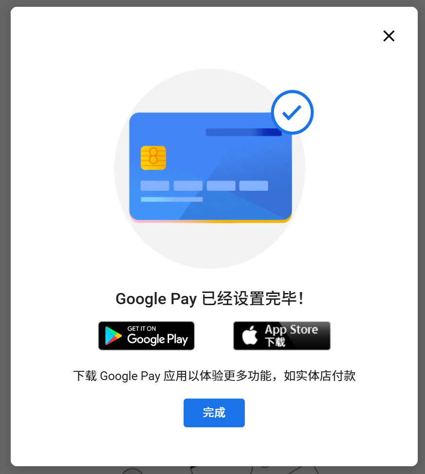

### 四、回到 https://one.google.com/ai-student 点击 `畅享学生优惠` 订阅 PRO

订阅
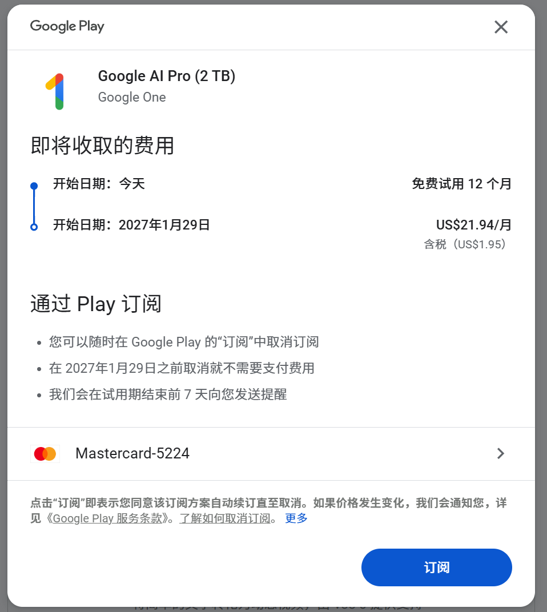
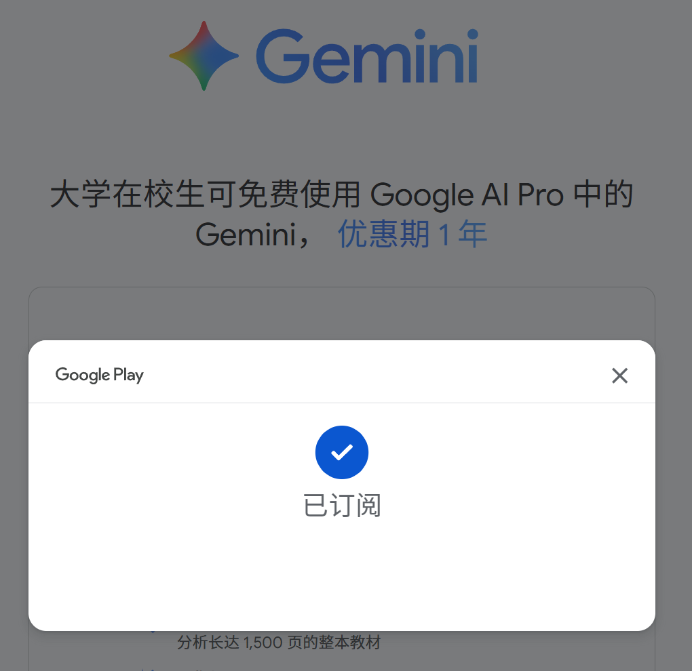

### 五、验证 PRO

https://gemini.google.com/app
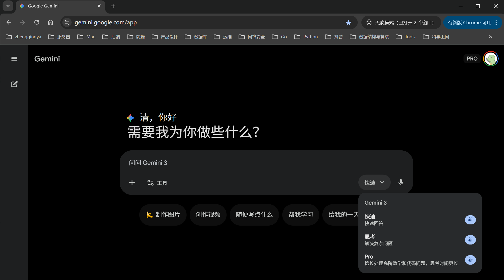

### 六、取消订阅 -- 防止后续扣费

https://play.google.com/store/account/subscriptions

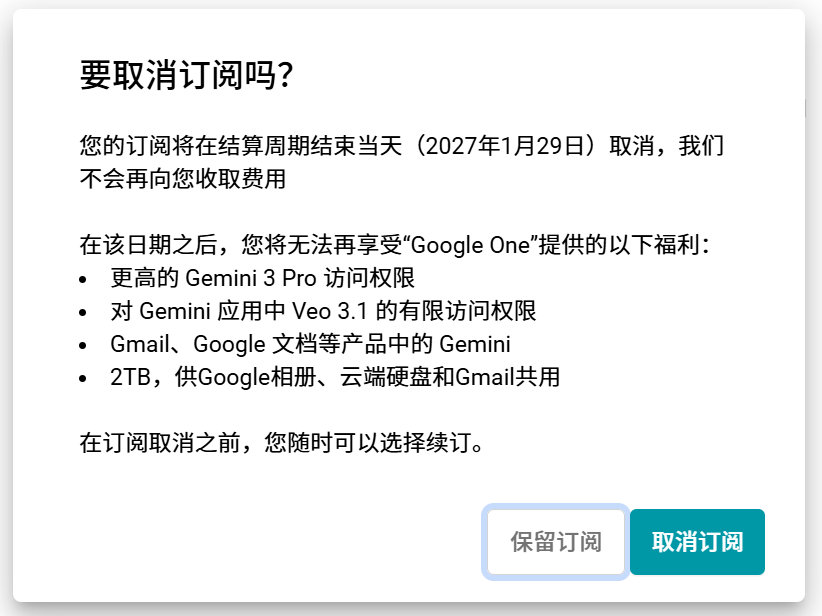
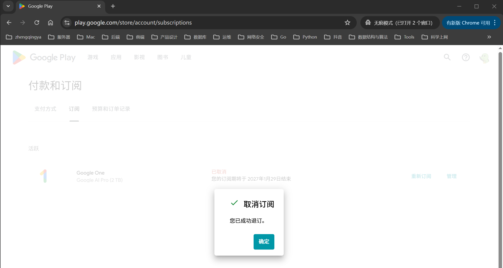
