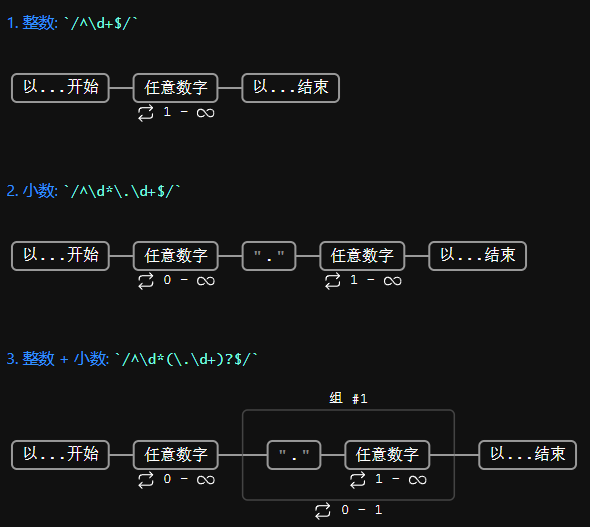
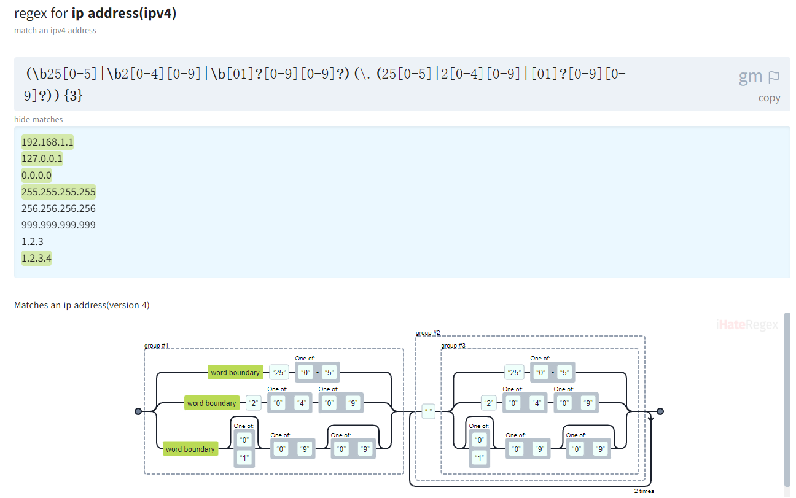

# regex-vis

> ☆☆☆

- https://github.com/Bowen7/regex-vis
- https://regex-vis.com/

可视化正则表达式

# iHateRegex

- https://github.com/geongeorge/i-hate-regex
- https://ihateregex.io/

# Regex101

- https://github.com/firasdib/Regex101
- https://regex101.com/
