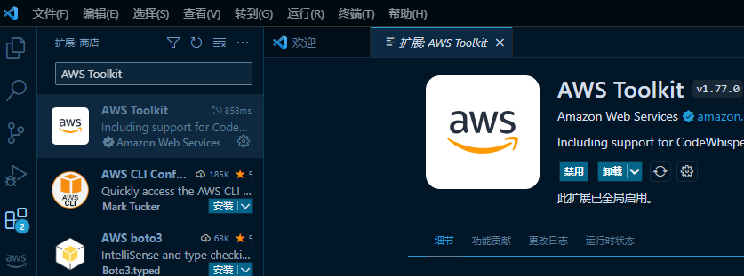
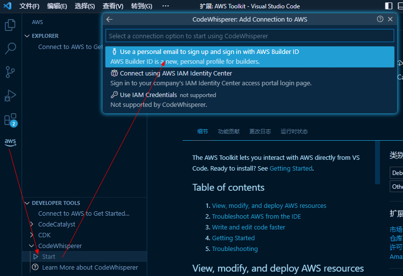
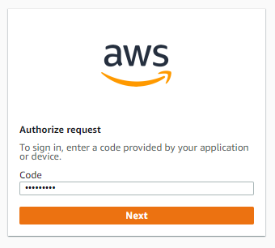
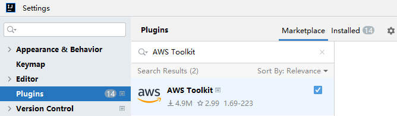
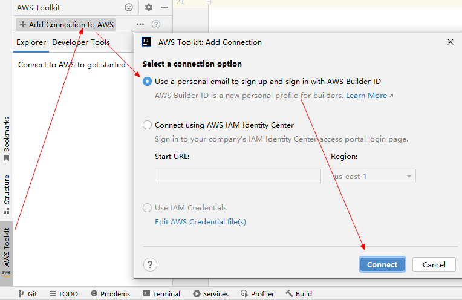

# Amazon CodeWhisperer

https://aws.amazon.com/cn/codewhisperer/

使用您的 AI 编码配套应用程序更快、更安全地构建应用程序

### 使用

#### eg: vscode

安装 `AWS Toolkit` 插件

跳转到浏览器中下一步

接着使用您的电子邮件地址注册并使用您的 AWS 构建者 ID 登录...

之后就可以使用体验了...

#### eg: idea

