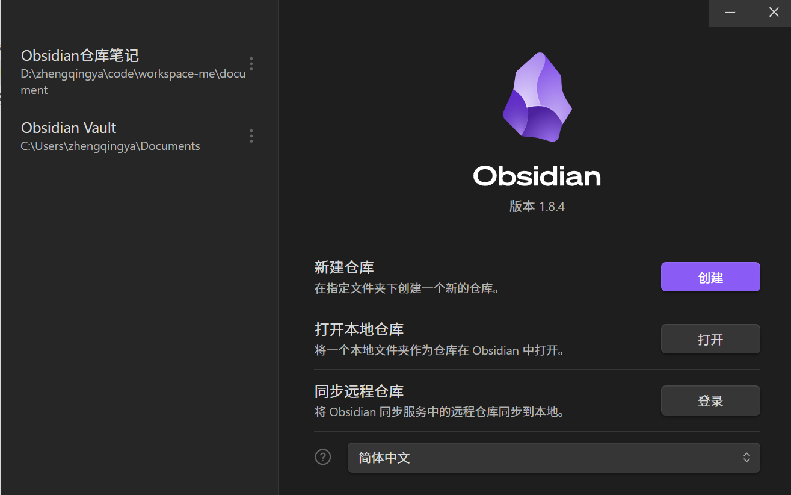
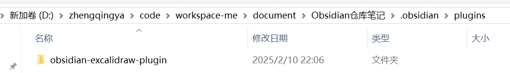
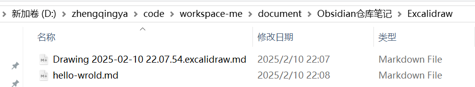
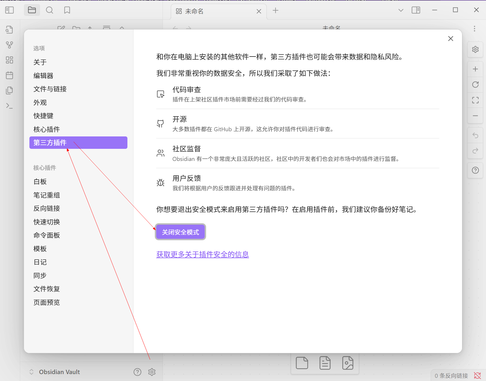
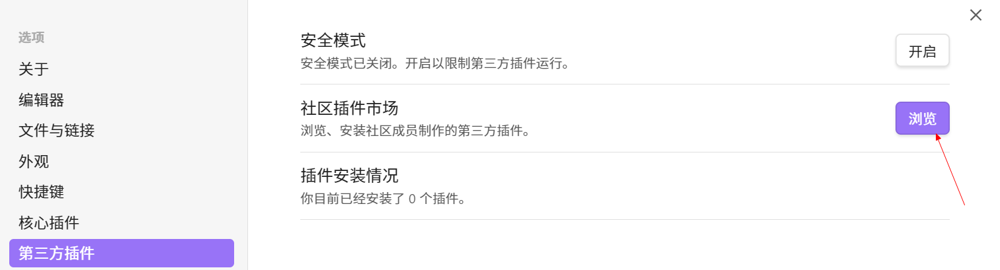
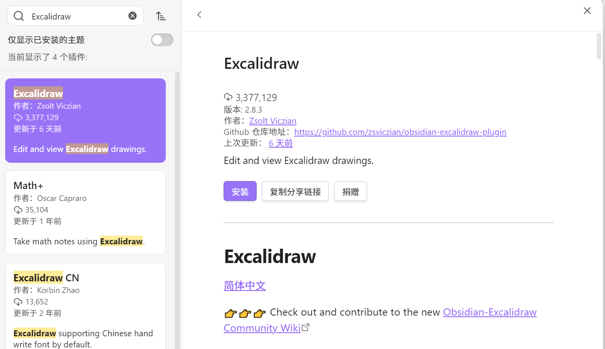
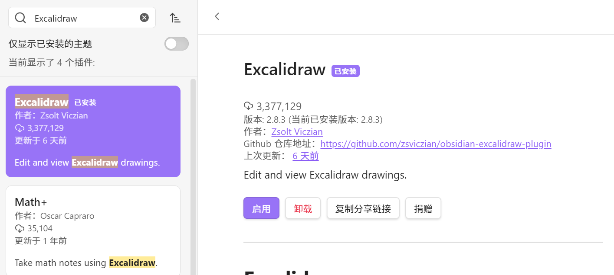
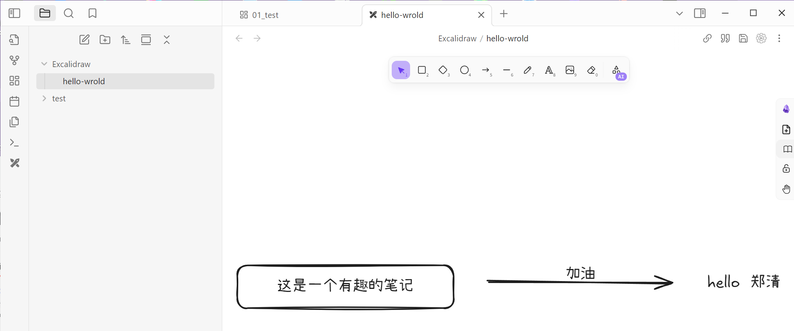

# Obsidian

### 一、安装

https://github.com/obsidianmd/obsidian-releases

### 二、仓库管理

仓库概念：类似一个单独的项目管理环境，可以使用git进行版本管理。

eg：`Obsidian仓库笔记`
里面包含插件存放

目录笔记

### 三、插件

#### 1、插件如何安装？

`设置` -> `第三方插件` -> `关闭安全模式`

`输入插件名称`（eg: Excalidraw） -> `安装`

`启用`插件

#### 2、好用的插件

#### Excalidraw

| 插件名称       | 作用简述 | 概览                                          |
|------------|------|---------------------------------------------|
| Excalidraw | 绘图工具 |  |

