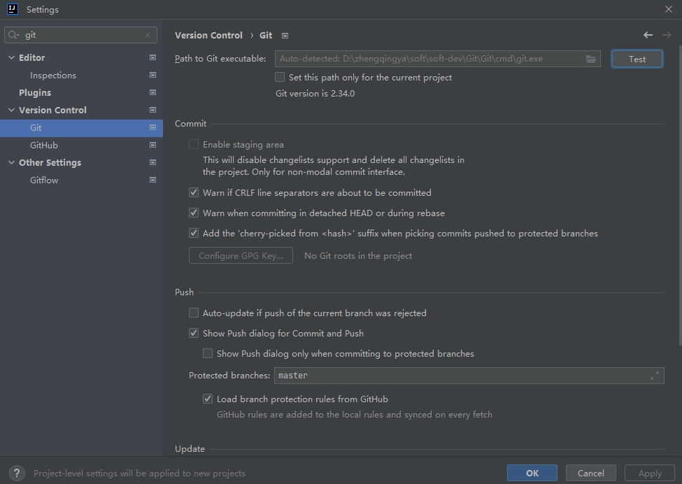
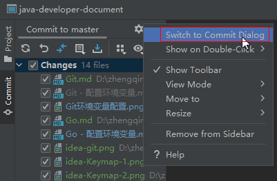
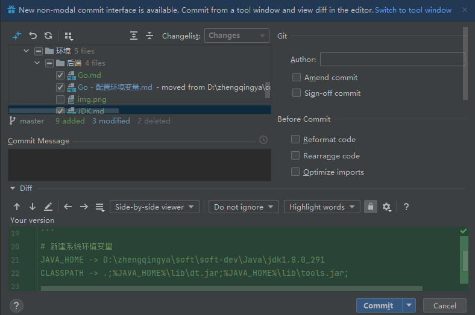

### Git配置

`File` -> `New Projects Setup` -> `Settings for New Projects...`

> 此idea版本好像会自动识别git配置，感觉有点厉害，无需自己单独配置了`^_^`



设置常用提交窗口





### 解决git提交代码每次输入帐号密码问题

```shell
# 在`Git Bash Here`命令行输入命令记住密码        -- 即第一次输入用户密码后，之后便可不再输入
git config --global credential.helper store
```