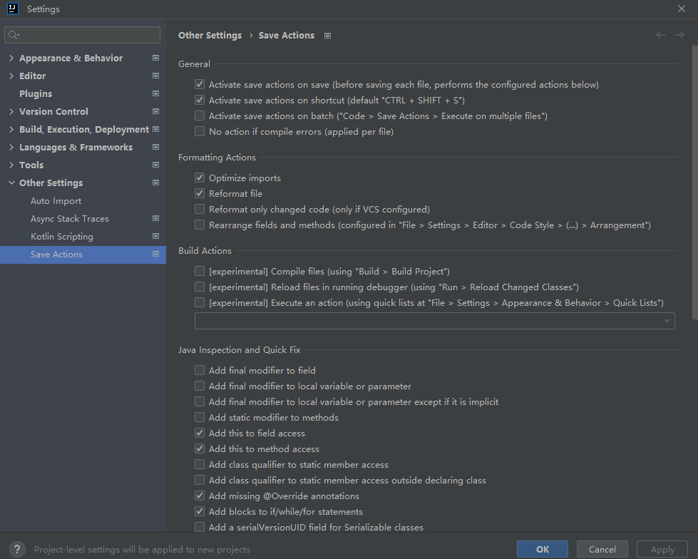

## 开发规范

### 代码规范 Code Style

> 注：配置其中一个 或者 都不配置使用IDE默认配置
> 我这里都未配置使用的IDE默认配置

###### Google

1. 下载[intellij-java-google-style.xml](https://github.com/google/styleguide/blob/gh-pages/intellij-java-google-style.xml)
2. 

###### 阿里

> 需`Eclipse Code Formatter`插件

1. 下载[eclipse-codestyle.xml](https://github.com/alibaba/p3c/tree/master/p3c-formatter)
2. 

### 阿里巴巴Java开发手册

[点击下载](https://github.com/alibaba/p3c/blob/master/Java%E5%BC%80%E5%8F%91%E6%89%8B%E5%86%8C(%E9%BB%84%E5%B1%B1%E7%89%88).pdf)

### 自动格式化代码`Ctrl + S`

> 需`Save Actions`插件

`File` -> `New Projects Setup` -> `Settings for New Projects...`

