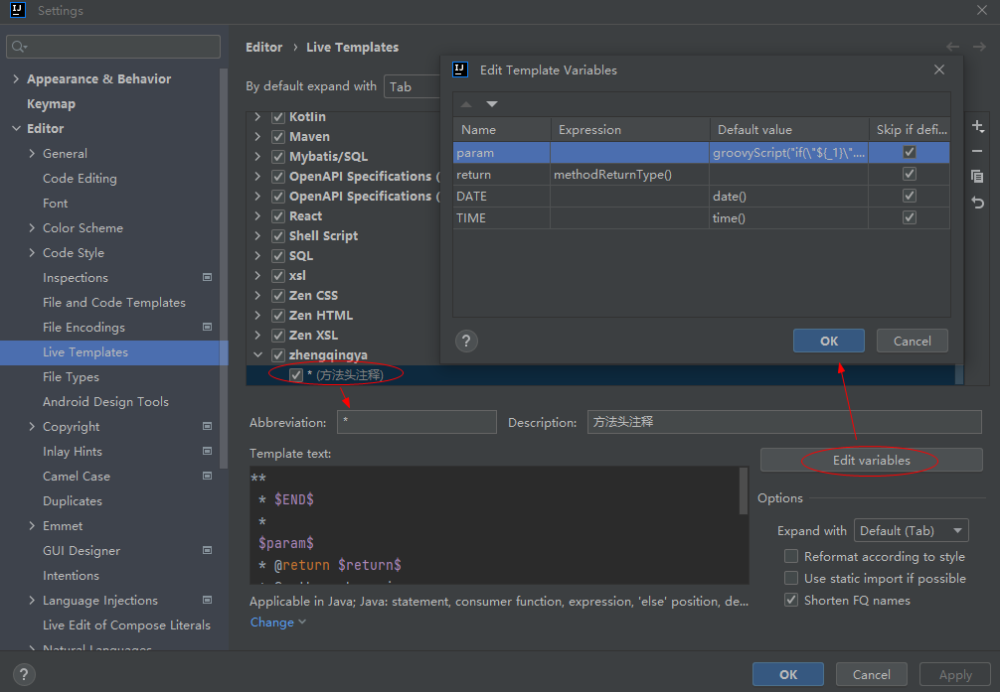
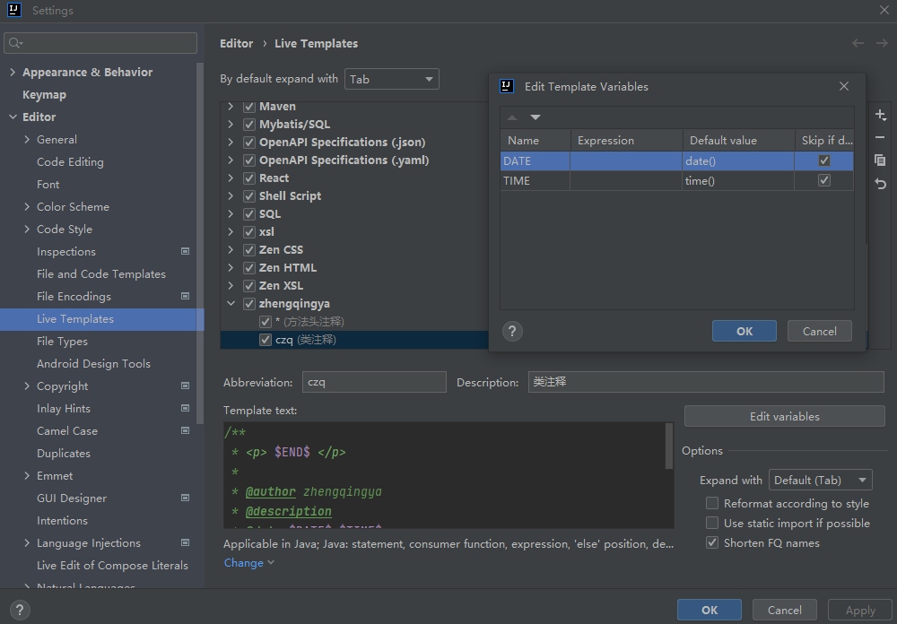

## 代码模板

`File` -> `Settings...` -> `Editor` -> `Live Templates`

### 方法头注释

> 使用方式： `/* + tab`

```
**
 * $END$ 
 *
 $param$
 * @return $return$
 * @author zhengqingya
 * @date $DATE$ $TIME$     
 */

$param$    ->  groovyScript("if(\"${_1}\".length() == 2) {return '';} else {def result=''; def params=\"${_1}\".replaceAll('[\\\\[|\\\\]|\\\\s]', '').split(',').toList();for(i = 0; i < params.size(); i++) {if(i==0){result+='* @param ' + params[i] + ' '}else{result+='\\n' + ' * @param ' + params[i] + ' '}}; return result;}", methodParameters());
$return$   ->  methodReturnType()
$DATE$     ->  date()
$TIME$     ->  time()
```

设置用于那些地方


模板参数配置



### 类注释

> 使用方式： `czq + 回车`

```
/**
 * <p> $END$ </p>
 *
 * @author zhengqingya
 * @description
 * @date $DATE$ $TIME$
 */
 
$DATE$     ->  date()
$TIME$     ->  time()
```



### junit4测试方法

> 使用方式： `jtest + 回车`

```
@Test
public void test$END$() throws Exception{
    
}
```

### switch case

> 使用方式： `swi + 回车`

```
switch(object){
    case OBJECT:
        break;
    default:
        break;
}
```

### Vue打印日志

> 使用方式： `vlog + 回车`

```
console.log($END$)
```

### shell注释

> 使用方式： `szq + 回车`

```
####################################
# @description $END$
# @params $? => 代表上一个命令执行后的退出状态: 0->成功,1->失败
#         ${1} => 脚本第1个参数
# @example => sh xx.sh
# @author zhengqingya
# @date $DATE$ $TIME$
####################################

$DATE$     ->  date()
$TIME$     ->  time()
```

### IntelliJ IDEA设置新建类时,自动注释作者信息和日期

`File` -> `New Projects Setup` -> `Settings for New Projects...` ->
`Editor` -> `File and Code Templates` -> `Includes` -> `File Header` 中添加以下代码

> 此处的${USER}会读取个人PC的用户名,$END$标识光标最后的位置

```
/**
 * Created by ${USER} on ${DATE} ${TIME}
 */

/**
 * @Author ${USER}
 * @Date ${DATE} ${TIME}
 * @Version 1.0
 */

/**
 *  <p> $END </p>
 *
 * @author zhengqingya
 * @description 
 * @date $DATE $TIME
 */
```


