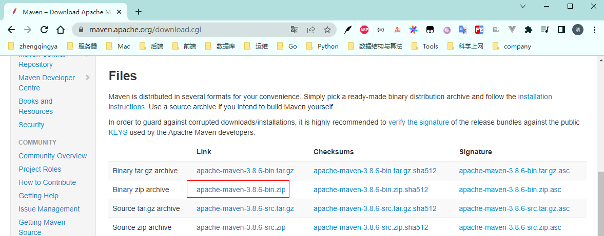
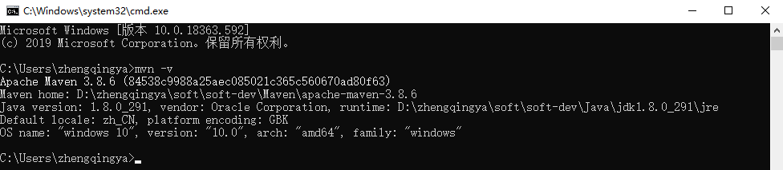

### Maven

[点击下载Apache Maven](http://maven.apache.org/download.cgi)



解压`apache-maven-3.8.6-bin.zip`

[点击查看安装与配置](https://zhengqing.blog.csdn.net/article/details/83956373)

### Maven - 配置环境变量

> `此电脑` -> `属性` -> `高级系统设置` -> `环境变量`

```
# 新建系统环境变量
MAVEN_HOME -> D:\zhengqingya\soft\soft-dev\Maven\apache-maven-3.8.6

# 编辑PATH环境变量，新增
%MAVEN_HOME%\bin

# 验证
mvn -v
```

