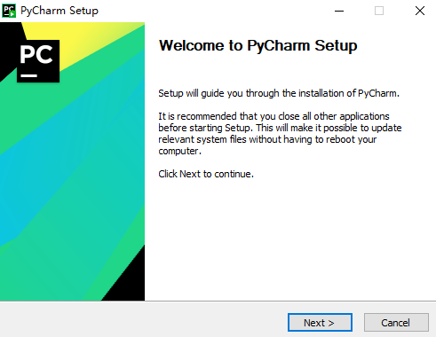
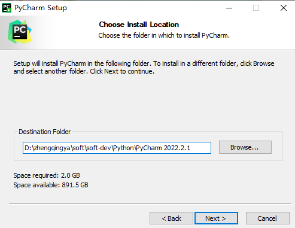
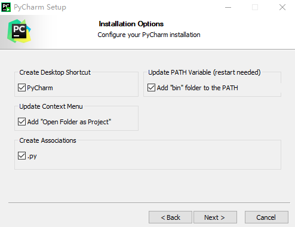

# PyCharm

PyCharm是一种Python的IDE，带有一整套可以帮助用户在使用Python语言开发时提高效率的工具，比如调试、语法高亮、Project管理、代码跳转、智能提示、自动完成、单元测试、版本控制...

> 本系列基于`pycharm-professional-2022.2.1.exe`操作

下载：https://www.jetbrains.com/pycharm/download

双击安装

安装完成之后重启电脑

