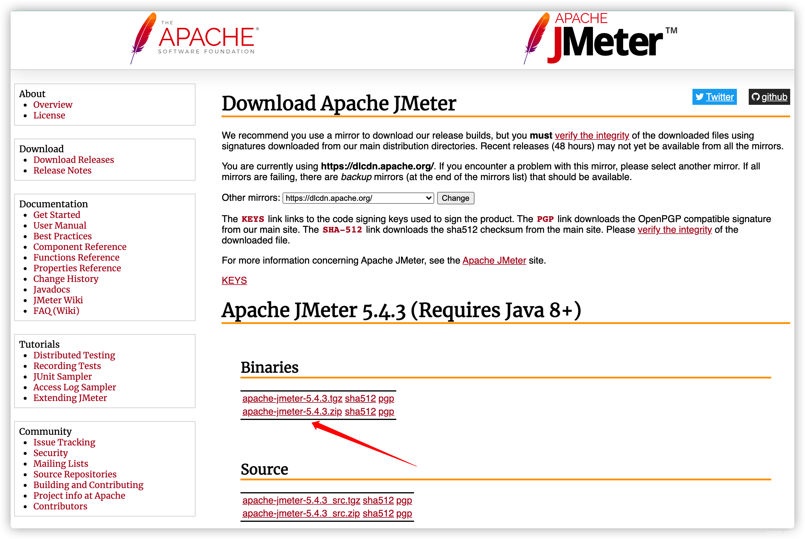
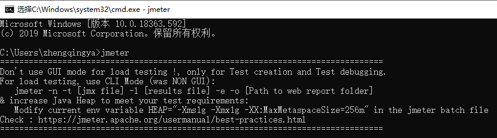

### 下载安装

下载 [https://jmeter.apache.org/download_jmeter.cgi](https://jmeter.apache.org/download_jmeter.cgi)


双击运行`apache-jmeter-5.5/bin/jmeter.bat`


### 配置

#### 1、配置环境变量快捷启动jmeter

> `此电脑` -> `属性` -> `高级系统设置` -> `环境变量`

```
# 新建系统环境变量
JMETER_HOME -> D:\zhengqingya\soft\soft-dev\apache-jmeter-5.5
# 编辑CLASSPATH环境变量，新增
%JMETER_HOME%\lib\ext\ApacheJMeter_core.jar; %JMETER_HOME%\lib\jorphan.jar;

# 编辑PATH环境变量，新增
%JMETER_HOME%\bin
```

验证

```
# win+r 输入 cmd 进入命令行
jmeter
```


