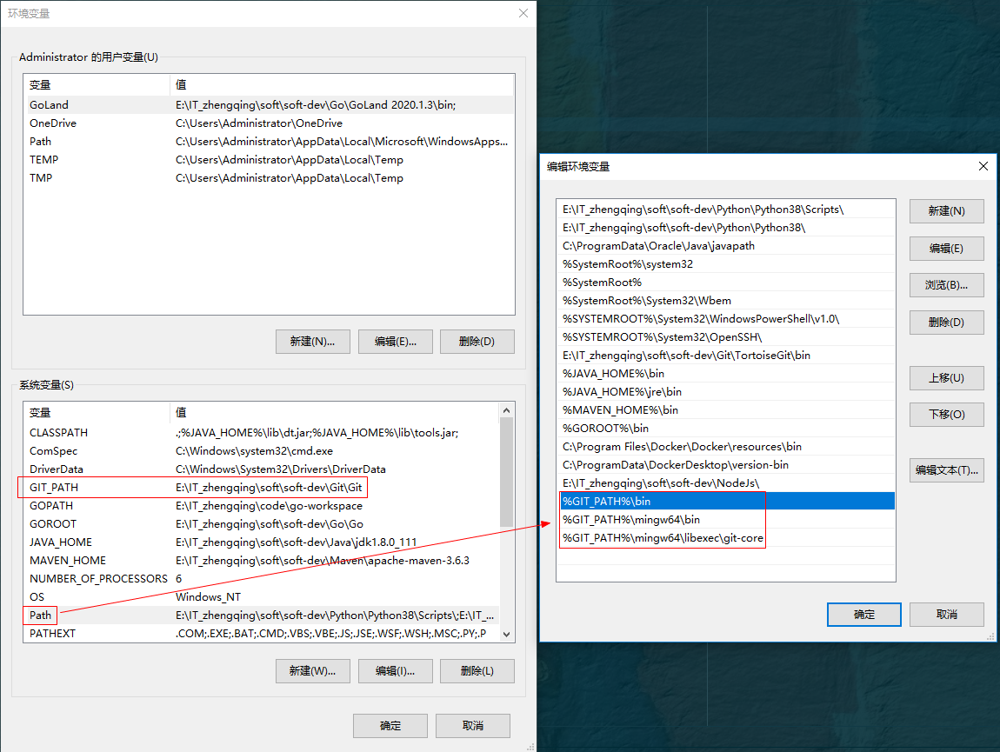

### Git

> tips: 可直接通过腾讯电脑管家->软件管理中搜索git直接安装，git环境变量会自动配置

1. [点击下载Git](https://git-scm.com/downloads)
2. [点击下载TortoiseGit](https://tortoisegit.org/download/)
3. [Git安装教程](https://zhengqing.blog.csdn.net/article/details/86213813)
4. [TortoiseGit安装教程](https://zhengqing.blog.csdn.net/article/details/86220668)

### Git - 配置环境变量

> `此电脑` -> `属性` -> `高级系统设置` -> `环境变量`

```
# 新建环境变量
GIT_PATH -> E:\IT_zhengqing\soft\soft-dev\Git\Git

# 编辑PATH环境变量，新增
%GIT_PATH%\bin
%GIT_PATH%\mingw64\bin
%GIT_PATH%\mingw64\libexec\git-core
```


