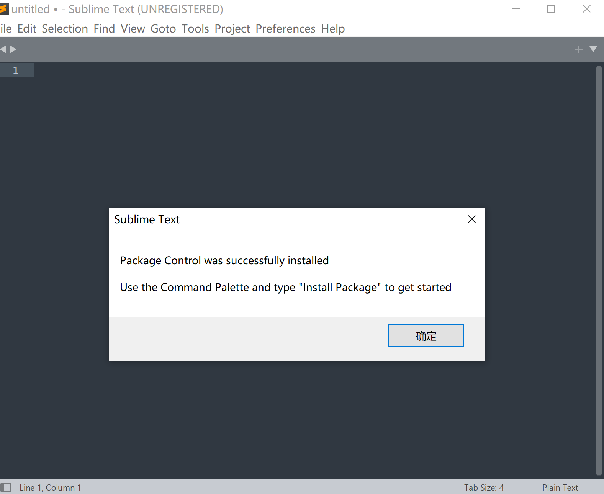
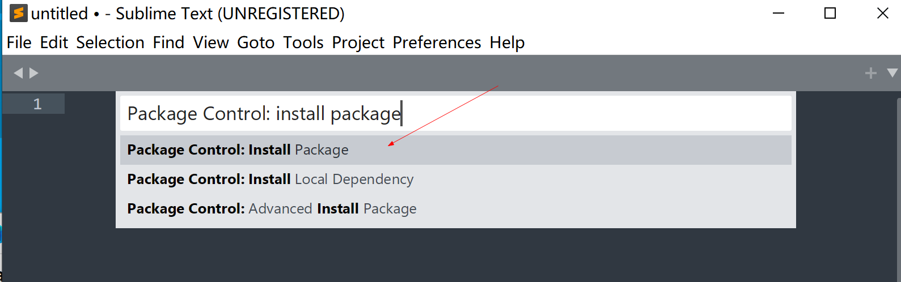
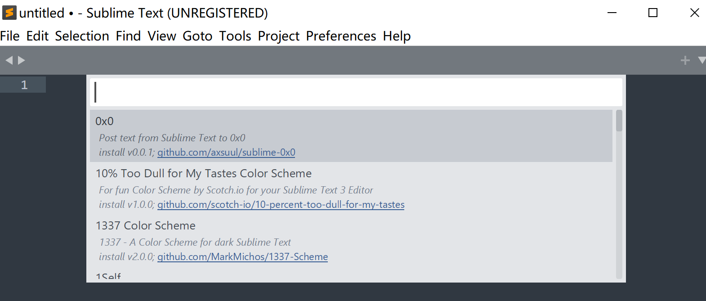
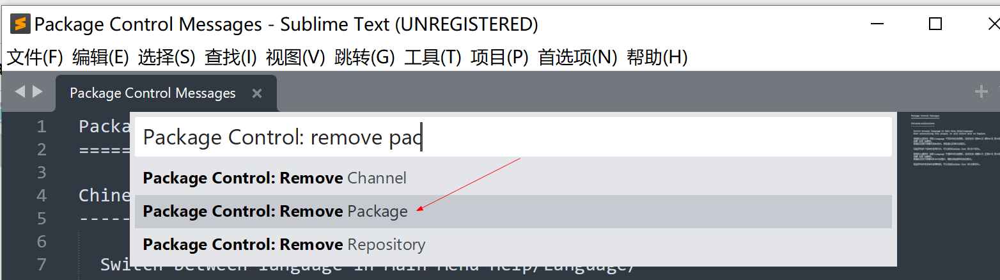

# Sublime Text 4

下载： https://www.sublimetext.com/download

### 配置

#### 安装套件

Tools -> Install Package Control...

Preferences -> Package Control

输入想要安装的套件

- 中文化套件： Chinese Localizations
- 颜色主题：RailsCasts Colour Scheme
- Git管理：Git
- 侧边栏同步文件位置：SyncedSideBar

#### 移除套件

Preferences -> Package Control

