# Git安装

> tips: 可直接通过腾讯电脑管家 -> 软件管理中搜索git直接安装，git环境变量会自动配置。

官网下载Git：[https://git-scm.com/downloads](https://git-scm.com/downloads)

双击 

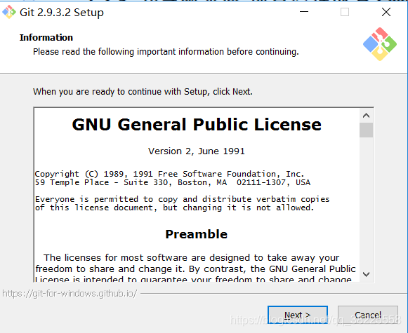

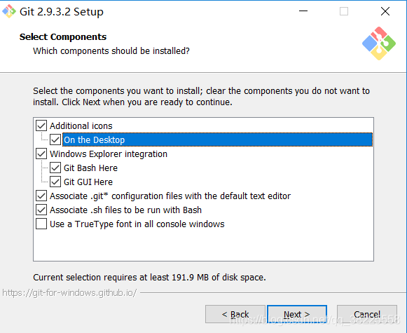

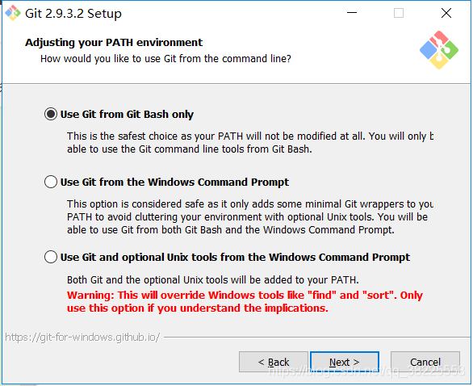

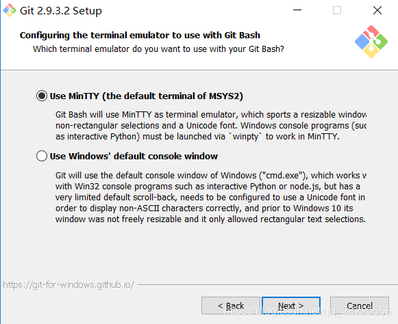
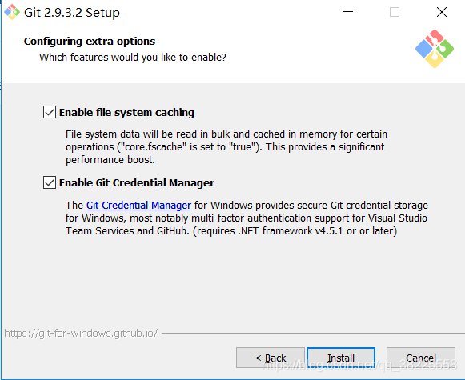
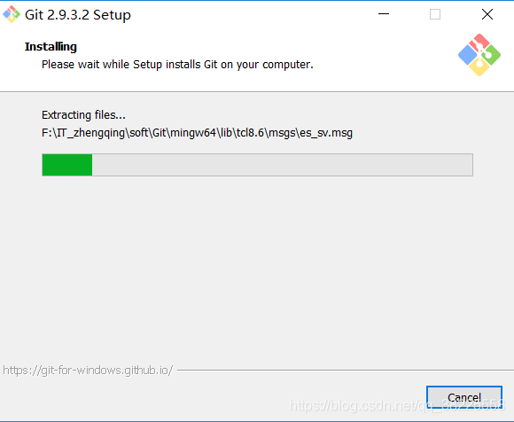

最后就安装成功了

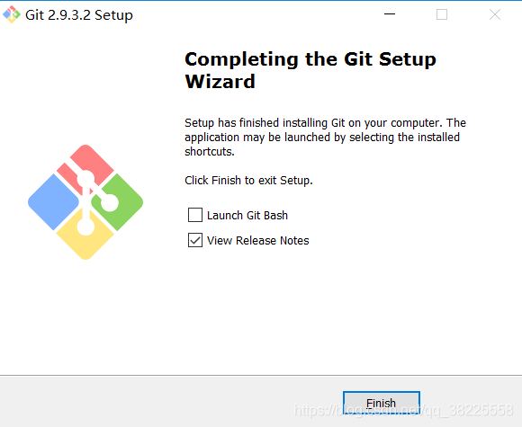

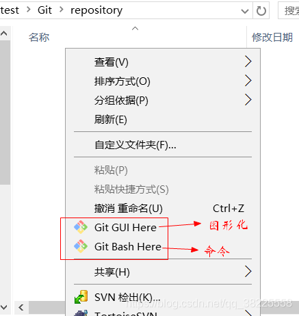

### Git - 配置环境变量

> `此电脑` -> `属性` -> `高级系统设置` -> `环境变量`

```
# 新建环境变量
GIT_PATH -> E:\IT_zhengqing\soft\soft-dev\Git\Git

# 编辑PATH环境变量，新增
%GIT_PATH%\bin
%GIT_PATH%\mingw64\bin
%GIT_PATH%\mingw64\libexec\git-core
```


# TortoiseGit安装

下载TortoiseGit [https://tortoisegit.org/download](https://tortoisegit.org/download)

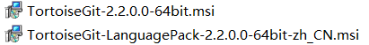
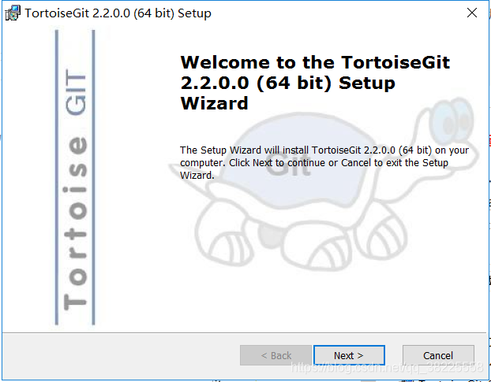
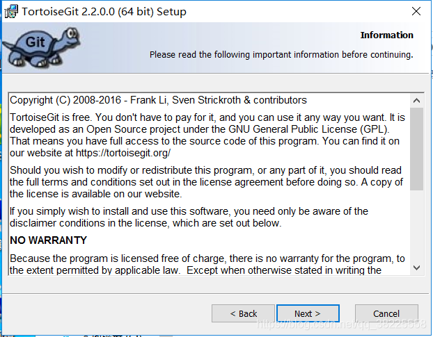
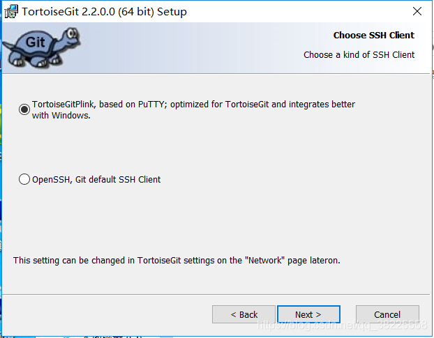

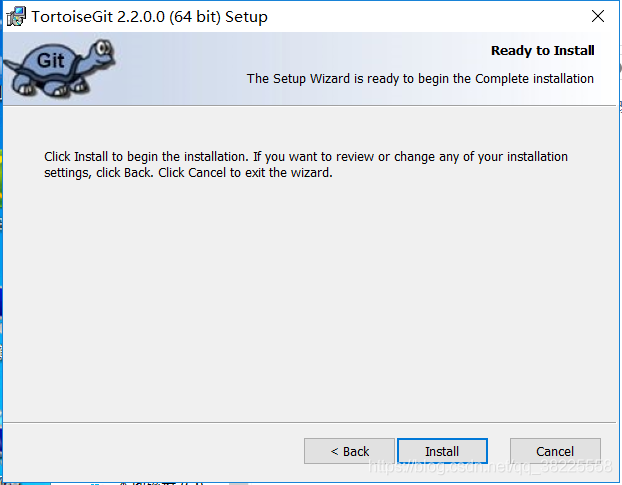
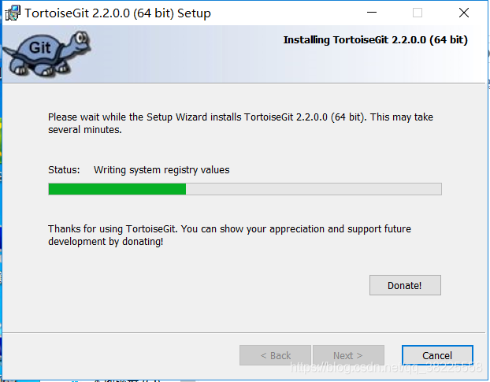
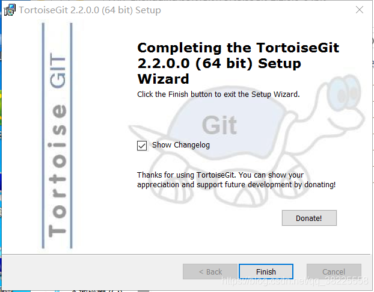
