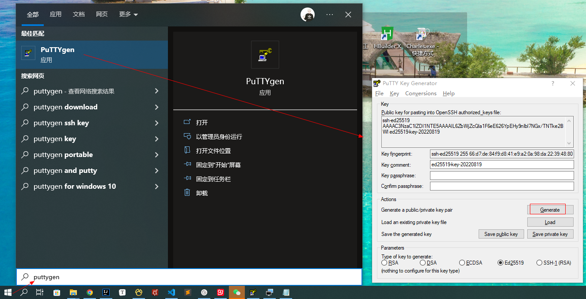
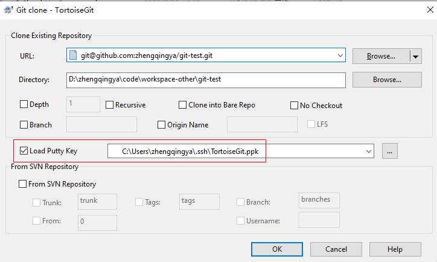

# 生成ssh密钥 - SSH认证方式拉取Git代码

> 可参考：
> 1. 阿里云Code：https://code.aliyun.com/help/ssh/README
> 2. Gitee：https://gitee.com/help/articles/4181#article-header0
> 3. GitHub：https://docs.github.com/cn/authentication/connecting-to-github-with-ssh

### GitHub

#### 方式1：命令

```shell
# 1. 生成ssh key 【 注：回车默认配置 】
ssh-keygen -t ed25519 -C "960869719@qq.com"

# windows生成文件在 `C:\Users\zhengqingya\.ssh` 目录下
#           id_ed25519：SSH公钥
#           id_ed25519.pub：SSH私钥

# 2. 查看生成的公钥
cat ~/.ssh/id_ed25519.pub
# ex:   
# ssh-ed25519 xxxxxx 960869719@qq.com

# 3. 将上面公钥拷贝到git页面ssh公钥中保存
#    github => https://github.com/settings/ssh/new

# 4. 查看已生成的私钥（本地拉取代码使用）
cat ~/.ssh/id_ed25519

# 5. 测试
ssh -T git@github.com
# Hi zhengqingya! You've successfully authenticated, but GitHub does not provide shell access.
# 拉取代码
git clone git@github.com:zhengqingya/git-test.git
```

#### 方式2：TortoiseGit

`Generate` -> `Save public key` -> `Save private key`


`Load Putty Key` 选择上面`Save private key`保存的`.ppk`文件
