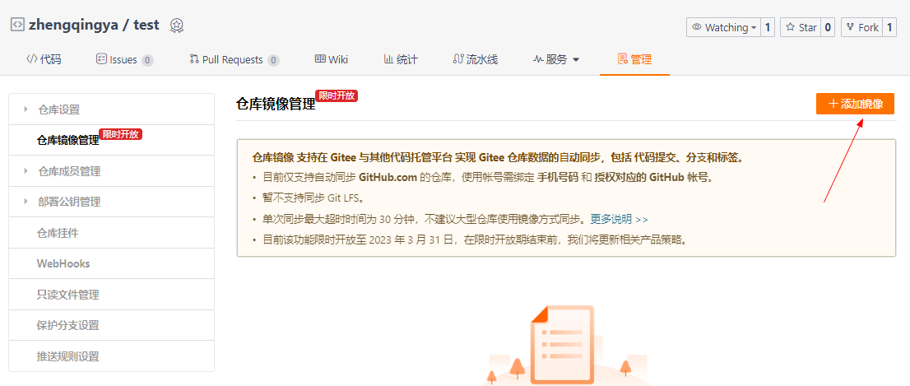
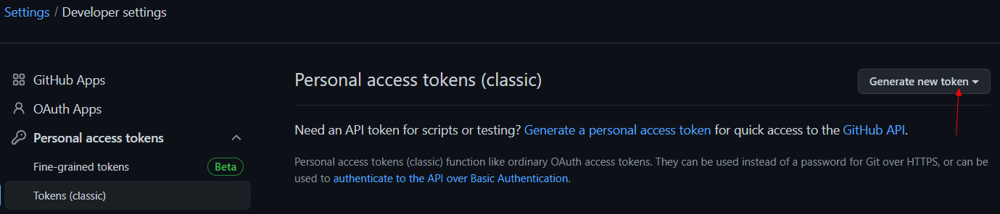
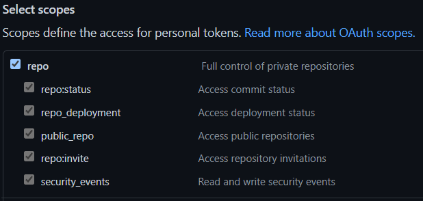
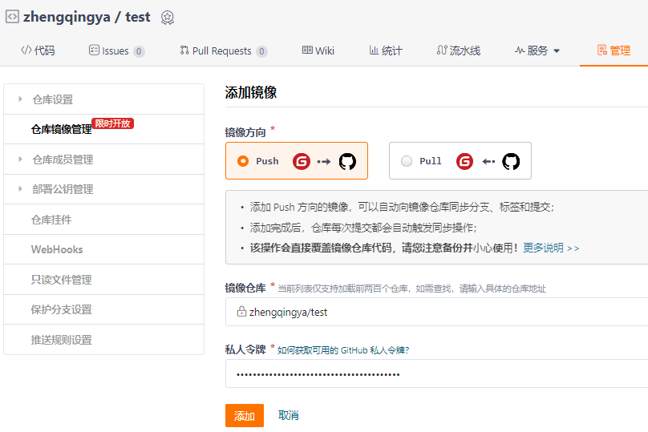
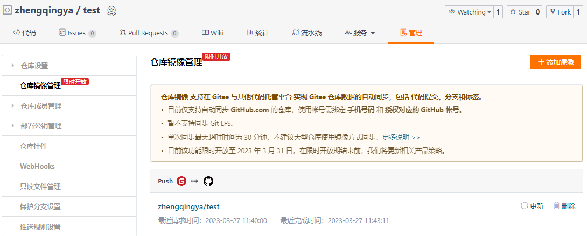

# Gitee同步推送GitHub

eg: 提交代码到`https://gitee.com/zhengqingya/test` 时，
自动同步推动到 `https://github.com/zhengqingya/test`

### Gitee添加镜像

### GitHub中创建一个私人令牌

https://github.com/settings/tokens

授权应用范围

### Gitee

再次提交代码到gitee的时候就会自动触发更新到github了。
