# 撤销merge

eg：在`dev`分支上开发完，想提交到`origin/release`分支，
结果不小心提交到`origin/master`分支了，需要撤销本次合并的merge

### 情景1：撤销未推送的合并 -- dev刚merge到master，未推送到远程仓库

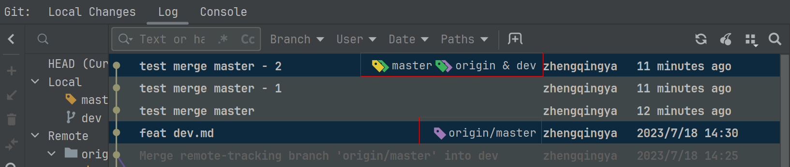

```shell
git checkout master

# 将 <commit-id> 替换为合并前的提交哈希id
git reset --hard <commit-id>
```

commit-id查看方式：
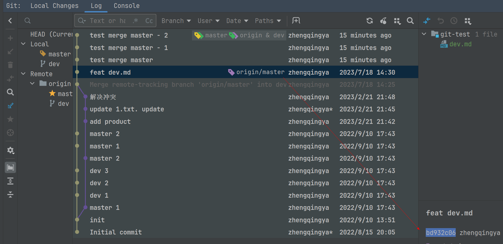
或
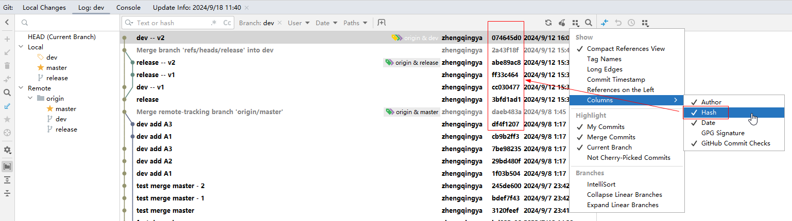

eg：

```shell
git reset --hard bd932c06
```

操作成功如下：
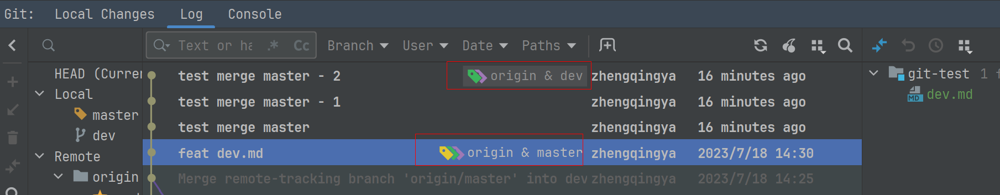


### 情景2：撤销已推送的合并 -- dev已经merge到master，且已推送到远程仓库

#### 情景2.1：reset重置提交 -- 没有其他人依赖于这次合并后的代码进行修改提交，您可以直接回退到合并之前的状态

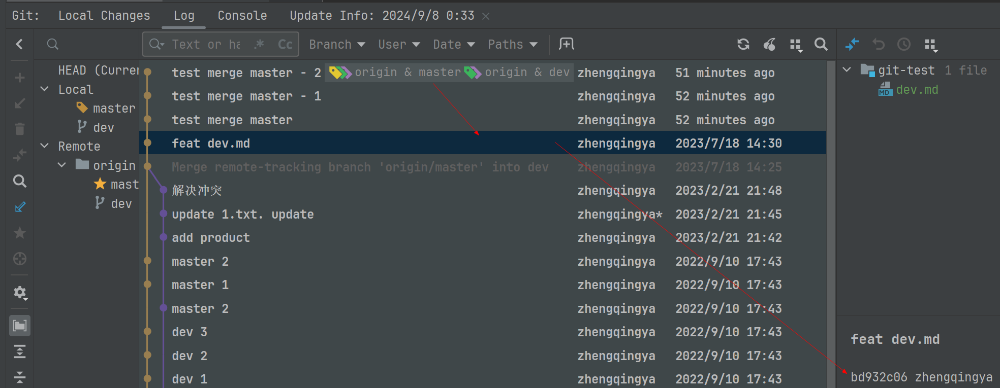

```shell
git checkout master
git reset --hard <commit-before-merge>  # 将 <commit-before-merge> 替换为合并前的提交哈希
git push origin master --force-with-lease
```

eg: 

```shell
git reset --hard bd932c06
```

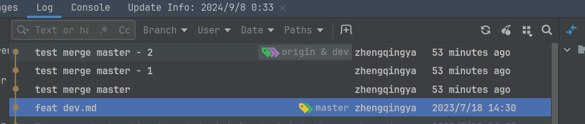

```shell
git push origin master --force-with-lease
```

操作成功如下：
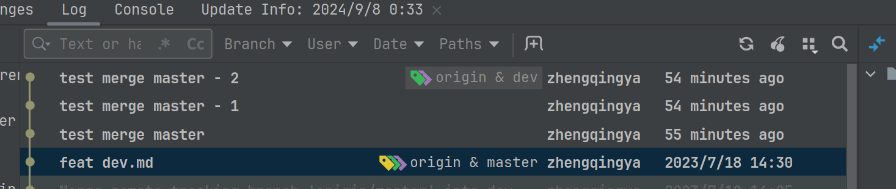

#### 情景2.2：revert回滚提交 -- 其他人已经基于这个合并做了修改提交，您应该创建一个新的合并来撤销之前的合并

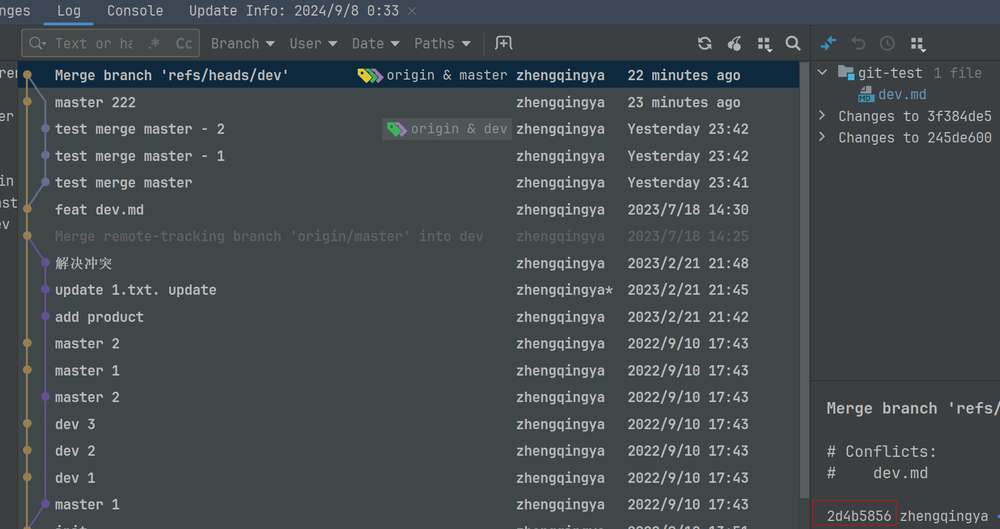


```shell
git checkout master

# 将 <merge_commit> 替换为实际的合并提交哈希id
git revert <merge_commit_id>
git push origin master --force-with-lease
```

eg:

```shell
git revert 2d4b5856
```

如果报错：

```shell
error: commit 2d4b58567045c01f2d50d67291978485f3057435 is a merge but no -m option was given.
fatal: revert failed
```

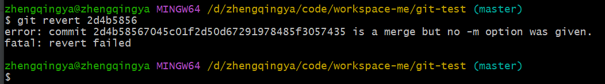

这时候需要指定 -m 选项来选择合并中的父提交。这是因为合并提交通常有两个或多个父提交，分别代表合并前的两个分支。

- 问题：不能确定合并的具体父提交

解决方式1: 

```shell
# 回滚dev分支的修改，保留master分支的提交（一般来说，只会使用到这种情况）
git revert -m 1 2d4b5856
# 回滚master分支的修改，保留dev分支的提交
git revert -m 2 2d4b5856
```

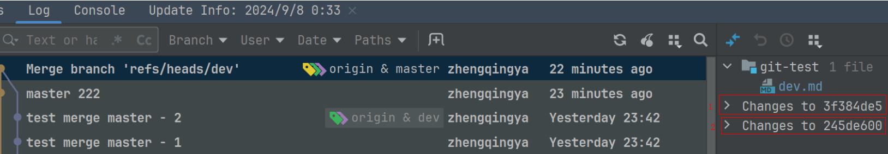

解决方式2:

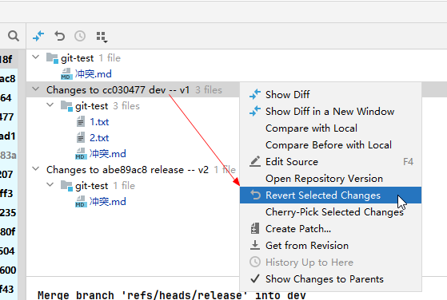


#### 情景2.2：补充说明

revert回滚提交之后，意味着dev分支开发的新功能代码合并到master分支之后，代码会丢失，因为已经revert了，如果需要恢复

操作步骤：

1. 基于master分支创建一个新分支`dev_v1`，并切换到新分支 (此分支包含revert记录)
2. 在`dev_v1`分支上，执行`git revert <revert_commit_id>`，恢复dev分支之前revert的代码 （`revert_commit_id`为之前revert的commit id）

idea中可以直接在之前revert操作的commit上右键，选择`Revert Commit`，即可恢复dev分支之前revert的代码。