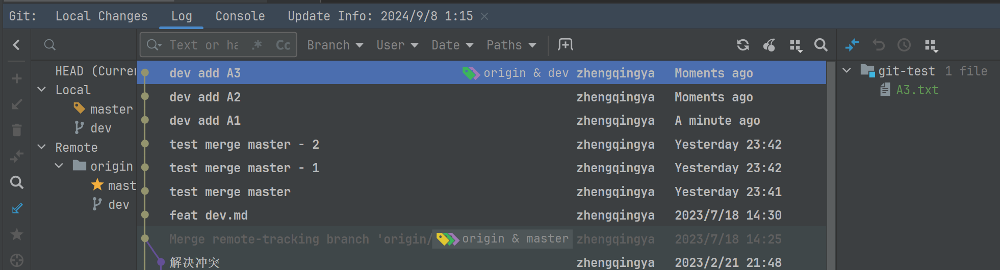
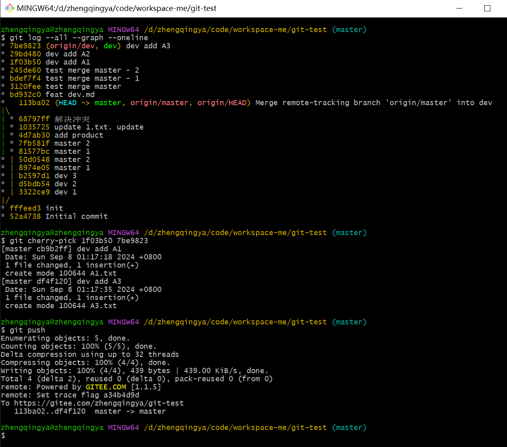

# cherry-pick

从dev分支选择N次提交，合并到master分支

```shell
git checkout master

# 将指定提交合并过来
git cherry-pick <commit_id1> <commit_id2>

git push

# 如果冲突，可以取消本次合并操作，或者解决冲突
git cherry-pick --abort
```

eg: 合并 dev分支的提交的A1和A3 



```shell
git log --all --graph --oneline
 
git cherry-pick 1f03b50 7be9823

git push
```


