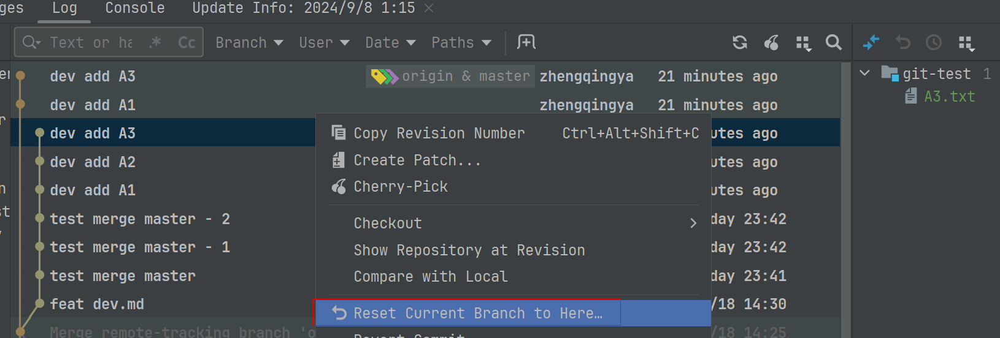

# revert 回滚提交

> tips: 未交给git版本管理的文件，不会受到影响

1. `版本3`：add 3.txt
2. `版本4`：add 4.txt
3. `版本5`：add 5.txt

eg：由于新需求提交的`版本4`和`版本5`做错了，想要回归至`版本3`，但又可能在有些场景需要保留`版本4`和`版本5`的内容或彻底不要，这时候就可以使用`重置提交`。




##### a、`Soft`：保持所有本地改动

3之后提交的文件不会丢失，且加入git版本管理

##### b、`Mixed`：保持工作副本并重置索引

3之后提交的文件不会丢失，且移出git版本管理

##### c、`Hard`：丢弃所有改动过的工作副本

3之后提交的所有文件丢失

##### d、`Keep`：丢弃所有改动过的工作副本，但保留本地暂存区未提交的代码

3之后提交的所有文件丢失，但加入本地暂存区未提交的代码将会被保留

### 强制推送到远程

```shell
git push origin master --force-with-lease
```