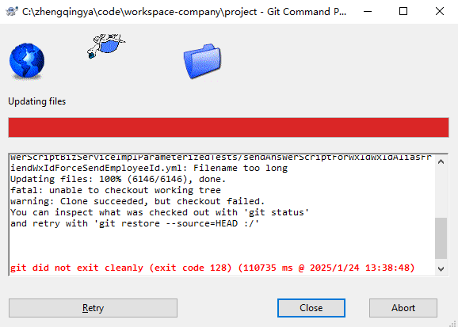

# 代码拉取失败-文件路径过长问题



在 Windows 系统上，Git 拉取项目时遇到 `Filename too long` 错误，通常是由于文件路径过长导致的。
Windows 对文件路径的长度有限制（通常是 260 个字符），而 Git 默认情况下不处理这个问题。

以下是几种解决这个问题的方法：

### 方法一：启用 Git 的长路径支持

Git 2.10 及以上版本支持长路径。你可以通过以下命令启用长路径支持：

1. **打开命令提示符或 Git Bash**。
2. **运行以下命令**：

    ```sh
    git config --system core.longpaths true
    ```

### 方法二：缩短文件路径

如果启用长路径支持后仍然遇到问题，可以考虑缩短文件路径。这可以通过以下几种方式实现：

1. **克隆到更短的路径**：
    - 将项目克隆到一个路径较短的目录中。例如：

        ```sh
        git clone <repository-url> C:\short\path\to\project
        ```


2. **重命名目录**：
    - 将项目目录重命名为较短的名称。

### 方法三：使用 Windows 10 的长路径支持

Windows 10 版本 1607 及以上版本支持长路径。你可以通过修改注册表来启用这一功能：

1. **打开注册表编辑器**：
    - 按 `Win + R`，输入 `regedit`，然后按回车。

2. **导航到以下路径**：

    ```
    HKEY_LOCAL_MACHINE\SYSTEM\CurrentControlSet\Control\FileSystem
    ```


3. **创建或修改 `LongPathsEnabled` 值**：
    - 找到 `LongPathsEnabled` 项，如果不存在则创建一个新的 `DWORD (32-bit) Value`。
    - 将 `LongPathsEnabled` 的值设置为 `1`。

4. **重启计算机**：
    - 修改注册表后需要重启计算机以使更改生效。

### 方法四：使用 WSL（Windows Subsystem for Linux）

如果你使用的是 Windows 10 或更高版本，可以考虑使用 WSL 来克隆和管理 Git 项目。WSL 提供了一个 Linux 环境，不受 Windows 文件路径长度限制。

1. **安装 WSL**：
    - 打开 PowerShell 作为管理员，运行以下命令：

        ```sh
        wsl --install
        ```


2. **安装 Linux 发行版**：
    - 按照提示安装一个 Linux 发行版（如 Ubuntu）。

3. **在 WSL 中克隆项目**：
    - 打开 WSL 终端，导航到你希望克隆项目的目录，然后运行：

        ```sh
        git clone <repository-url>
        ```


### 方法五：使用 Git Bash 的 `git config` 设置

你也可以在 Git Bash 中设置 `core.longpaths`：

1. **打开 Git Bash**。
2. **运行以下命令**：

    ```sh
    git config --global core.longpaths true
    ```


### 示例

假设你已经安装了 Git 并且版本是 2.10 或更高，你可以按照以下步骤操作：

1. **启用长路径支持**：

    ```sh
    git config --system core.longpaths true
    ```


2. **克隆项目**：

    ```sh
    git clone <repository-url> C:\short\path\to\project
    ```


通过以上方法，你应该能够解决 `Filename too long` 错误并成功拉取项目。
如果问题仍然存在，请确保你的 Git 版本是最新的，并尝试其他方法。
