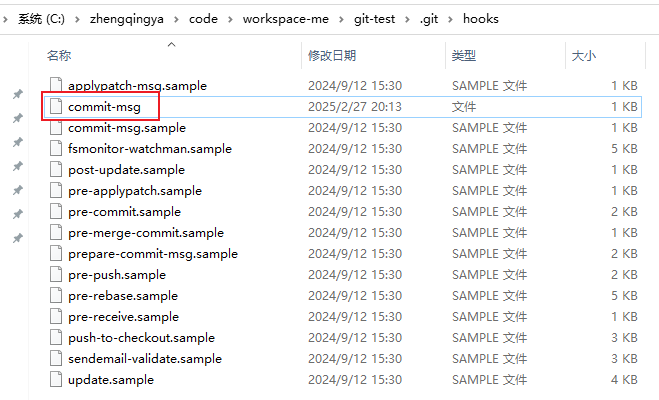
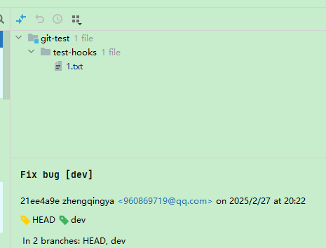
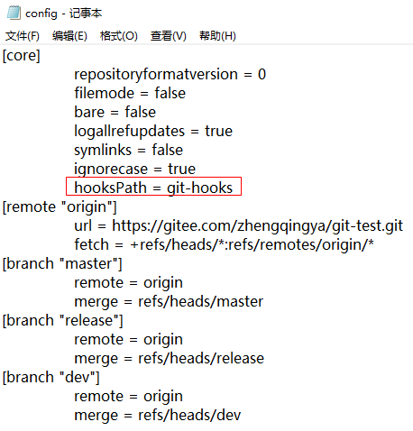
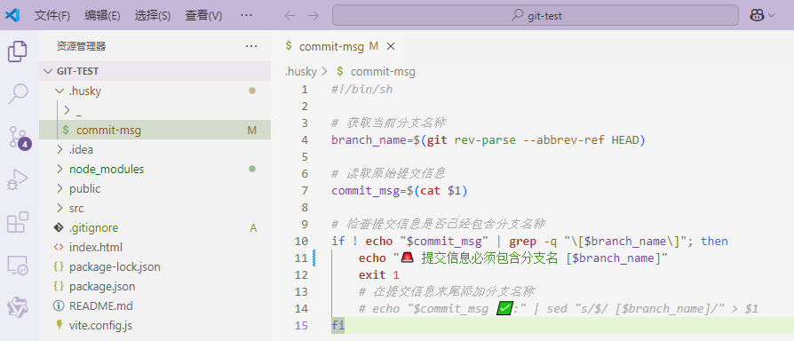
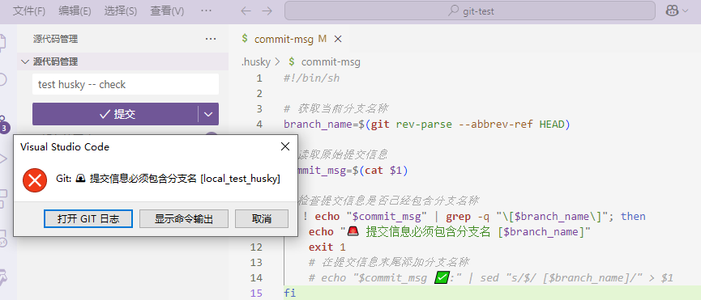
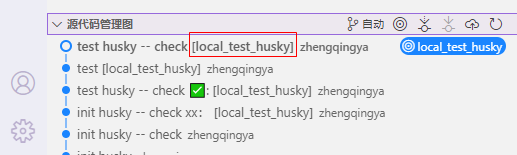
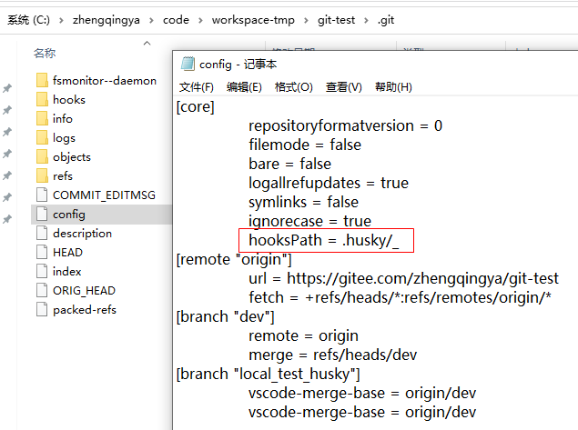

# Git钩子（Git Hooks）

功能：允许你在特定事件发生时触发自定义脚本。这些事件包括提交之前、提交之后、推送之前等。
通过使用Git钩子，你可以自动化执行一些任务，比如代码风格检查、运行测试、阻止不符合规范的提交等。

以下是常用的几种Git钩子：

- **pre-commit**：在提交之前运行，常用于代码格式化或检查。
- **commit-msg**：在提交信息编辑完成但尚未记录之前运行，可以用来验证提交信息的格式。
- **post-commit**：在提交完成后运行，可用于通知或其他后处理任务。
- **pre-push**：在`git push`命令开始之前运行，通常用于防止不符合要求的代码推送到远程仓库。
- **pre-receive**、**update**、**post-receive**：这些钩子位于服务器端，在接收来自客户端的推送时触发。

### 一、如何创建和使用Git钩子

1. **进入项目的.git/hooks目录**：
   每个Git仓库都有一个`.git/hooks`目录，默认情况下该目录下有一些示例钩子文件。
2. **编写钩子脚本**：
   你可以根据需要创建一个新的钩子文件或者修改已有的示例文件。钩子文件通常是可执行的Shell脚本，但也可以是其他语言编写的程序（如Python、Ruby等），只要确保它们可以通过解释器正确执行。
3. **使钩子文件可执行**：
   使用`chmod +x <hook-file>`命令赋予钩子文件执行权限。
4. **测试钩子**：
   触发相应的Git操作（例如做一次提交或推送），以确保你的钩子按预期工作。
5. **共享钩子**：
   如果希望团队成员都能使用你设置好的钩子，可以将钩子脚本放在项目根目录中，并编写安装说明指导他人如何配置。

请注意，虽然Git钩子非常有用，但也应该谨慎使用，特别是当涉及到多人协作开发时，确保所有开发者都了解并同意使用的钩子规则。

### 二、示例：Git钩子-提交信息后自动添加分支名称

使用 `commit-msg` 钩子来修改提交信息。

#### 1、进入 Git 仓库的 hooks 目录

```shell
cd .git/hooks
```

#### 2、创建或编辑 `commit-msg` 钩子脚本

```shell
touch commit-msg
chmod +x commit-msg
```




#### 3、编写 `commit-msg` 钩子脚本

```shell
#!/bin/sh

# 获取当前分支名称
branch_name=$(git rev-parse --abbrev-ref HEAD)

# 读取原始提交信息
commit_msg=$(cat $1)

# 检查提交信息是否已经包含分支名称
if ! echo "$commit_msg" | grep -q "\[$branch_name\]"; then
    # 在提交信息末尾添加分支名称
    echo "$commit_msg" | sed "s/$/ [$branch_name]/" > $1
fi
```

#### 4、保存并退出编辑器

这样，每次你提交代码时，`commit-msg` 钩子会自动在提交信息的末尾添加当前分支的名称。

#### 5、示例

假设你当前在 `feature-branch` 分支上，提交信息为 `Fix bug`，那么提交后，提交信息会自动变为 `Fix bug [feature-branch]`。


### 三、自定义目录来存放 Git 钩子文件

> tips: 通过这种方式，自定义hooks目录虽然进行了版本管理，但项目首次拉取下来时需要执行 `git config core.hooksPath git-hooks` 才能触发此项目钩子生效。因为`.git/config`配置并没有进行git版本管理。

通过这个配置，你可以将钩子文件放在版本控制下的项目目录中，而不是默认的 `.git/hooks` 目录中（这个目录是 Git 仓库的私有目录，不会进行版本管理，即不能被其他开发者共享访问）。

这样做的好处是：
- 便于共享：钩子文件可以和代码一起被版本控制，确保所有开发者都能使用相同的钩子。
- 易于管理：钩子文件集中存放在项目目录中，方便管理和更新。

```shell
# <path>：是你希望存放钩子文件的目录路径，可以是相对路径或绝对路径。
# git config core.hooksPath <path>

# eg:
git config core.hooksPath git-hooks
```

项目结构如下：

```
my-project/
├── .git/
├── git-hooks/                # 自定义钩子目录
│   ├── commit-msg
│   └── ...
├── src/
└── README.md
```

这会修改或创建 `.git/config` 文件中的 `core.hooksPath` 设置，内容如下：
```ini
[core]
    hooksPath = git-hooks
```



#### 效果

1. **克隆项目后自动生效**：当其他开发者克隆该项目时，Git 会从指定的 `git-hooks` 目录加载钩子文件，而不需要手动复制或安装。
2. **版本控制钩子文件**：钩子文件可以像普通代码一样进行版本控制、提交和推送，确保所有开发者使用一致的钩子逻辑。
3. **简化部署流程**：在 CI/CD 环境中，也可以通过这种方式确保钩子文件的一致性。

#### 注意事项

- **权限问题**：确保钩子文件具有可执行权限（如 `chmod +x git-hooks/pre-commit`），否则它们不会被执行。
- **跨平台兼容性**：如果你的团队成员使用不同操作系统，请确保钩子脚本具有良好的跨平台兼容性，或者为不同平台提供不同的钩子实现。

通过使用 `git config core.hooksPath`，你可以更灵活地管理和分发 Git 钩子，提升团队协作效率和代码质量。

### 四、husky 配置Git钩子

> 适用于前端node环境。这种方式配置好之后，进行版本管理，其它人拉取项目后也可以生效。

#### 1、安装 husky

```shell
npm install husky --save-dev
npx husky install

# 将 husky 的初始化脚本添加到 package.json 中，确保每次安装依赖后自动启用 husky
npm pkg set scripts.prepare="husky install"
```

#### 2、创建 commit-msg 钩子

`.husky/commit-msg`



```shell
#!/bin/sh

# 获取当前分支名称
branch_name=$(git rev-parse --abbrev-ref HEAD)

# 读取原始提交信息
commit_msg=$(cat $1)

# 检查提交信息是否已经包含分支名称
if ! echo "$commit_msg" | grep -q "\[$branch_name\]"; then
    echo "🚨 提交信息必须包含分支名 $branch_name"
    exit 1
    # 在提交信息末尾添加分支名称
    # echo "$commit_msg ✅:" | sed "s/$/ [$branch_name]/" > $1
fi
```

#### 3、提交信息 -- 测试钩子是否生效

不包含分支名，提交失败


包含时，提交成功


查看 `.git/config` 配置文件，发现`hooksPath`配置了`.husky`目录！


