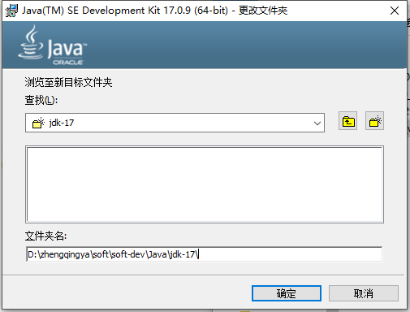
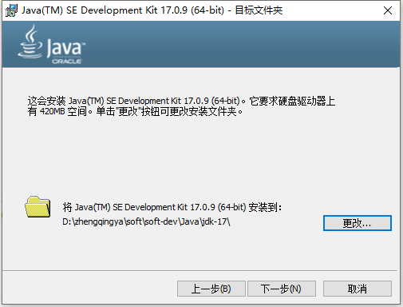
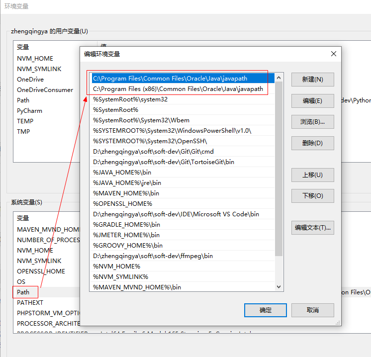
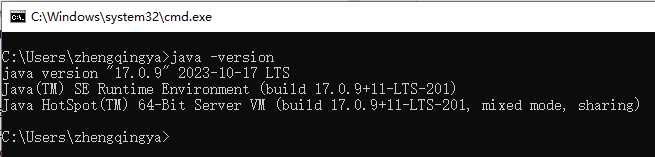

### JDK17 安装

点击下载 https://www.oracle.com/java/technologies/downloads/#jdk17-windows

eg: `jdk-17_windows-x64_bin.exe`

双击安装即可，很简单

可根据自己的需要修改jdk/jre安装目录





### JDK - 配置环境变量

> `此电脑` -> `属性` -> `高级系统设置` -> `环境变量`

JDK17会在安装的时候自动配置环境变量，我们先删除掉




重新配置下环境变量

```
# 新建系统环境变量
JAVA_HOME -> D:\zhengqingya\soft\soft-dev\Java\jdk-17
CLASSPATH -> .;%JAVA_HOME%\lib\dt.jar;%JAVA_HOME%\lib\tools.jar;

# 编辑PATH环境变量，新增
%JAVA_HOME%\bin
```

验证

```
# win+r 输入 cmd 进入命令行
java
javac
java -version
```




### JDK 卸载

1. 控制面板卸载jdk
2. 将配置的jdk环境变量相关java的信息删除（JAVA_HOME classpath Path）
3. 把`C:\Windows\System32`下面的java开头的文件删除（注意不要删除其他软件的）

最后cmd输入java和javac，如果没有打印则表示卸载成功！！