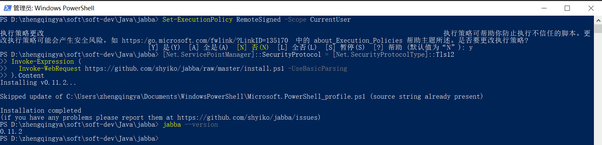
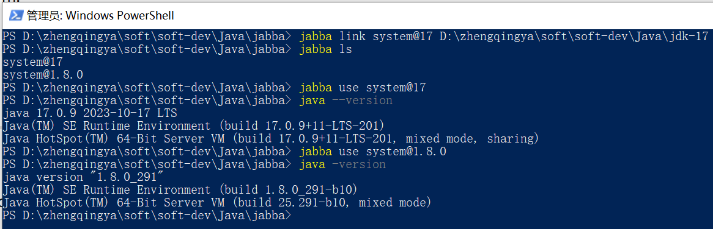
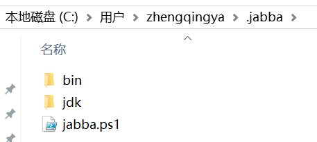
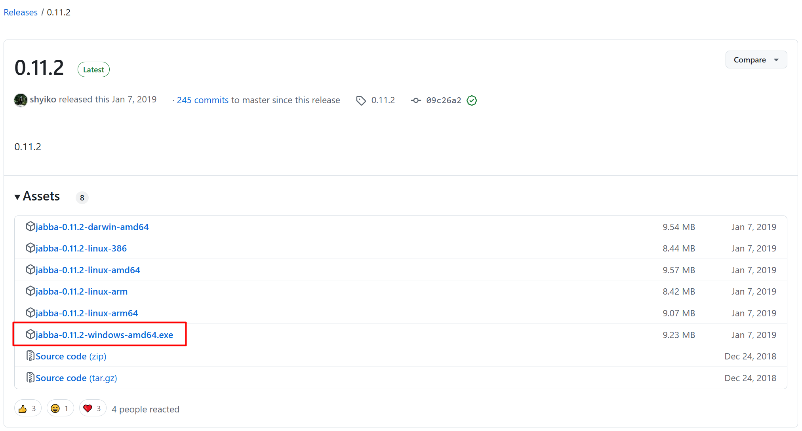
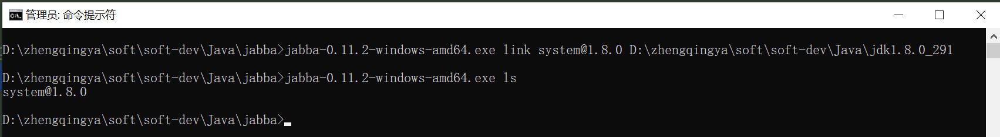

# JDK多版本管理工具

### 主流工具对比

|                      **工具名称**                       |                                **特点**                                 |         **适用场景**          | **安装复杂度** |
|:---------------------------------------------------:|:---------------------------------------------------------------------:|:-------------------------:|:---------:|
|    **[jabba](https://github.com/shyiko/jabba)**     | 跨平台（Linux/macOS/Windows），类似 `nvm`，支持多种 JDK 发行版（OpenJDK、Oracle JDK 等）。 |   简单、轻量级，适合纯 Java 开发者。    |   ⭐️⭐️    |
| **[SDKMAN!](https://github.com/sdkman/sdkman-cli)** | 支持多语言（Java、Groovy、Scala 等），集成多种 JDK 发行版（Azul Zulu、Amazon Corretto 等）。 |     多语言混合开发，需要统一管理工具。     |  ⭐️⭐️⭐️   |
|      **[jenv](https://github.com/jenv/jenv)**       |         类似 `rbenv`/`pyenv`，通过 Shell 插件管理 JDK 版本，支持手动指定项目 JDK。         | 已有 `rbenv`/`pyenv` 经验的用户。 |  ⭐️⭐️⭐️   |
|     **[asdf](https://github.com/asdf-vm/asdf)**     |                扩展性极强，支持 Java、Node.js、Python 等，可自定义插件。                 |     多语言全栈开发，需要统一管理工具。     | ⭐️⭐️⭐️⭐️  |
|             **fnm (Fast Node Manager)**             |                     类似 `nvm`，但速度更快，支持 Java 和其他语言。                     |        追求速度，轻量级切换。        |   ⭐️⭐️    |
|     **[jvms](https://github.com/ystyle/jvms)**      |                        适用于 Windows 的 JDK 版本管理器                        |            轻量级            |   ⭐️⭐️    |

### asdf

https://asdf-vm.com/zh-hans/

> linux、macOS 环境 推荐使用

---

### jabba

#### window环境安装

##### 法一：

> tips:
> 1. 可能会存在网络问题，需要科学上网。
> 2. 此方式安装之后，只能在 PowerShell 中使用，CMD 中无法使用。

以管理员身份运行 PowerShell，执行如下命令：

```shell
# 修改 PowerShell 执行策略
Set-ExecutionPolicy RemoteSigned -Scope CurrentUser
# 说明：
# RemoteSigned：允许运行本地编写的脚本（无需签名），远程下载的脚本需数字签名（更安全）。
# -Scope CurrentUser：仅修改当前用户的策略，不影响系统全局。

# 安装 jabba
[Net.ServicePointManager]::SecurityProtocol = [Net.SecurityProtocolType]::Tls12
Invoke-Expression (
  Invoke-WebRequest https://github.com/shyiko/jabba/raw/master/install.ps1 -UseBasicParsing
).Content
  
# 验证安装
jabba --version
```



使用 -- 通过jabba安装jdk11

```shell
# 查看服务器可以安装的版本
jabba ls-remote

# install Oracle JDK -- 很容易因为网络问题失败，建议先将jdk下载到本地后再通过link方式链接本地jdk
jabba install openjdk@1.11.0

# 查看所有安装的JDK版本
jabba ls

# 切换使用的JDK版本
jabba use openjdk@1.11.0

# 卸载JDK
jabba uninstall openjdk@1.11.0

# 将系统中已安装的jdk链接到jabba中
jabba link system@1.8.0 D:\zhengqingya\soft\soft-dev\Java\jdk1.8.0_291
jabba link system@17 D:\zhengqingya\soft\soft-dev\Java\jdk-17
```



jabba卸载：在Windows上，是在`/%USERPROFILE%/.jabba`这个目录安装。卸载jabba ，只需删除此目录即可。

eg: 存放目录：`C:\Users\zhengqingya\.jabba`


##### 法二：

> 不推荐

下载：https://github.com/shyiko/jabba/releases/tag/0.11.2



以管理员身份运行cmd，执行命令：


