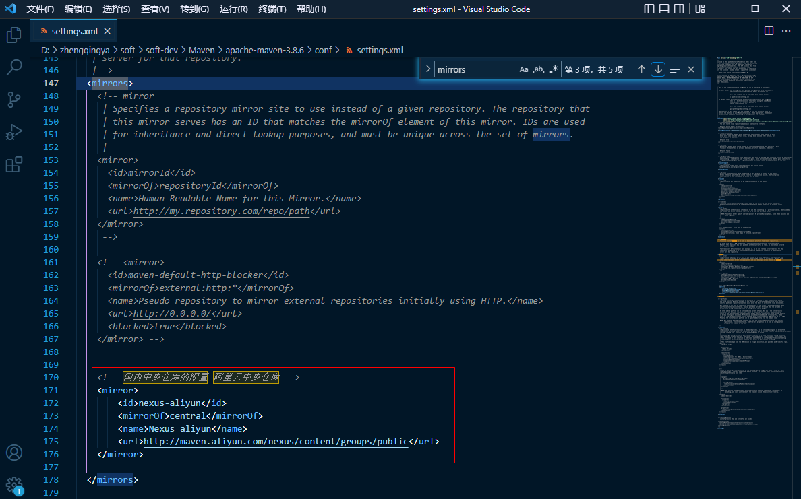

### Maven - 配置阿里云中央仓库

修改`${MAVEN_HOME}\conf\settings.xml`

```
<mirrors>
    <!-- 国内中央仓库的配置-阿里云中央仓库 -->
    <mirror>
        <id>nexus-aliyun</id>
        <mirrorOf>central</mirrorOf>
        <name>Nexus aliyun</name>
        <url>http://maven.aliyun.com/nexus/content/groups/public</url>
    </mirror>
</mirrors>
```

