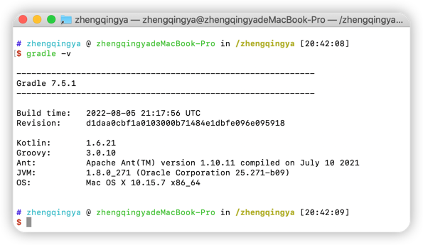
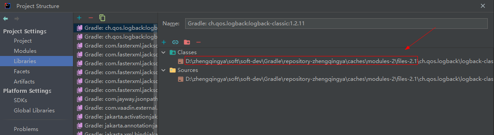

### Gradle

> https://gradle.org

[点击下载Gradle](https://gradle.org/releases/)

### Gradle - 配置环境变量

#### windows 配置

```
# 新建环境变量
GRADLE_HOME -> D:\zhengqingya\soft\soft-dev\Gradle\gradle-7.5.1
# 仓库地址  -- 可配置Gradle和Maven共用同一个仓库地址 -- 仅是和maven放在同一位置，并非和maven共享jar包资源
# GRADLE_USER_HOME  ->  D:\zhengqingya\soft\soft-dev\Maven\repository-zhengqingya
GRADLE_USER_HOME  ->  D:\zhengqingya\soft\soft-dev\Gradle\repository-zhengqingya

# 编辑PATH环境变量，新增
%GRADLE_HOME%\bin

# 验证
gradle -v
```


#### mac 配置

```
# 添加环境变量
open -e ~/.bash_profile

############################## ↓↓↓↓↓↓ set gradle environment ↓↓↓↓↓↓ #############################
GRADLE_HOME=/zhengqingya/soft/soft-dev/Gradle/gradle-7.5.1
# 仓库地址  -- 可配置Gradle和Maven共用同一个仓库地址 -- 仅是和maven放在同一位置，并非和maven共享jar包资源
# GRADLE_USER_HOME=/zhengqingya/soft/soft-dev/Maven/repository-zhengqingya
GRADLE_USER_HOME=/zhengqingya/soft/soft-dev/Gradle/repository-zhengqingya
PATH=$PATH:$GRADLE_HOME/bin
export GRADLE_HOME GRADLE_USER_HOME PATH
################################################################################################


# 使配置生效
source ~/.bash_profile

# 验证
gradle -v
```



### Gradle - 配置仓库源

全局配置文件: `Gradle安装目录/init.d` -> 新建文件`init.gradle`

> 作用：避免每个项目都去配置

```
allprojects {
    repositories {
        // maven { url 'file:///D:/zhengqingya/soft/soft-dev/Maven/repository-zhengqingya'}  // 本地的Maven仓库路径
        mavenLocal()     // 先从本地仓库寻找jar包，找不到再走下面的
        maven { name "aliyun" ; url "https://maven.aliyun.com/repository/public" }  // 阿里仓库
        mavenCentral()   // maven中央仓库
    }

    buildscript { 
        repositories { 
            maven { name "aliyun" ; url 'https://maven.aliyun.com/repository/public' }
        }
    }
}
```

---

gradle存放下载依赖后的jar包目录`${GRADLE_USER_HOME}\caches\modules-2\files-2.1`

