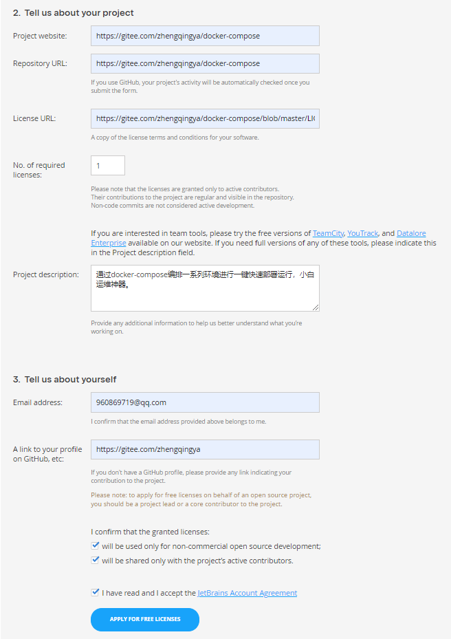

### IntelliJ IDEA

[点击下载 IDEA](https://www.jetbrains.com/zh-cn/idea/download/#section=windows)

> 本系列基于`ideaIU-2022.1.1.win`操作

安装之后

`windows`

```
# 配置存放目录
C:\Users\zhengqingya\AppData\Roaming\JetBrains\IntelliJIdea2022.1
# 日志存放目录 -- 用于观察启动异常日志
C:\Users\zhengqingya\AppData\Local\JetBrains\IntelliJIdea2025.2\log
```

`mac`: 配置存放目录

```
# 注：因为路径有空格原因直接进不去，需要一层一层进入或路径加上双引号进入
open "/Users/zhengqingya/Library/Application Support/JetBrains/IntelliJIdea2021.1"
```

### IDE 激活

申请开源开发许可证 -> https://www.jetbrains.com/shop/eform/opensource

eg:


