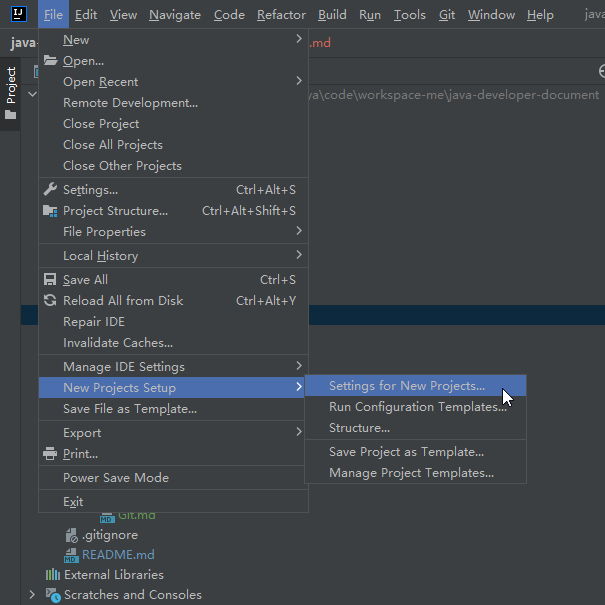

### Gradle配置

#### `Gradle user home`

> 查看IDEA安装目录`D:\zhengqingya\soft\soft-dev\IDE\ideaIU-2022.1.1.win\plugins\gradle\lib`下匹配的gradle版本，对应自己安装的gradle版本不能太老

> 如果需要idea新开的所有项目配置都生效，操作 `File` -> `New Projects Setup` -> `Settings for New Projects...`
> 

> gradle安装好，配置`GRADLE_USER_HOME`环境变量之后，idea这里会自动识别;
> 识别不到可尝试重启idea;
> 有需要的自行修改；
> 我这里默认配置即可。


#### 控制台中文乱码

> tips: 修改完后需重启IDEA才能生效！

`Help` -> `Edit Custom VM Options...` 新增配置

```
-Dfile.encoding=UTF-8
```

