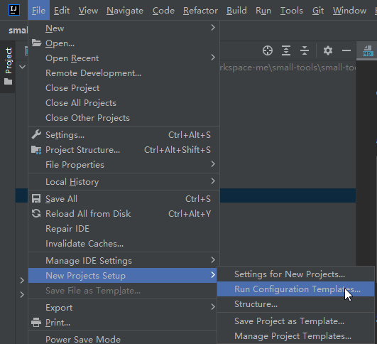
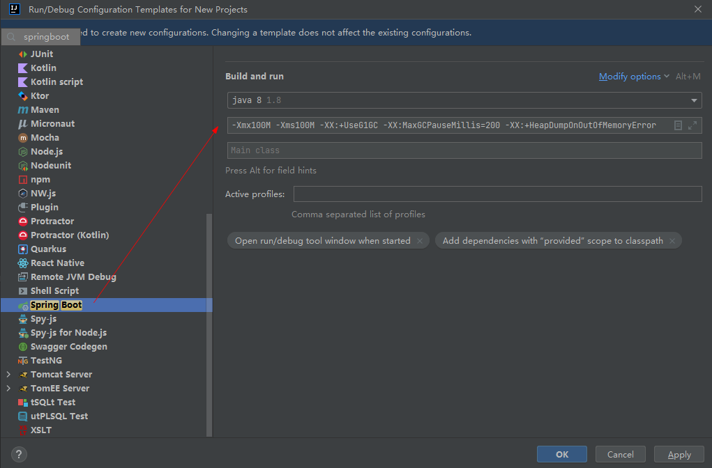
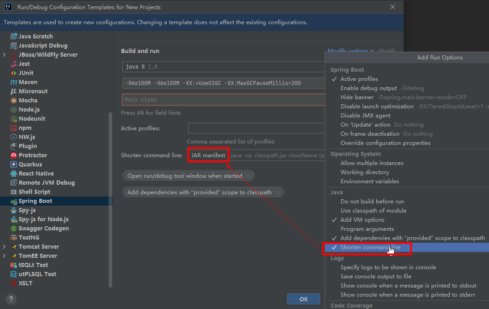
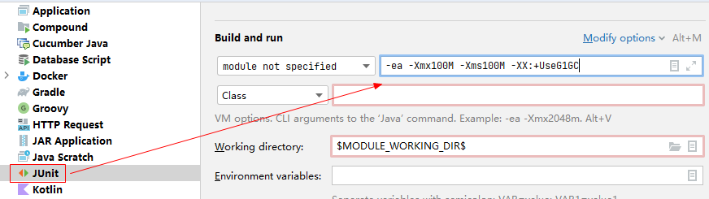

### java新运行项目配置

`File` -> `New Projects Setup` -> `Run Configuration Templates...`



idea每次打开新项目时，设置jvm启动默认参数 => 调优节省本地内存空间

```
-Xmx100M -Xms100M -XX:+UseG1GC -XX:MaxGCPauseMillis=200 -XX:+HeapDumpOnOutOfMemoryError
```

### `Spring Boot`





### `JUnit`

```
-Xmx100M -Xms100M -XX:+UseG1GC
```



### `Application`

> main方法运行

```
-Xmx100M -Xms100M -XX:+UseG1GC
```


