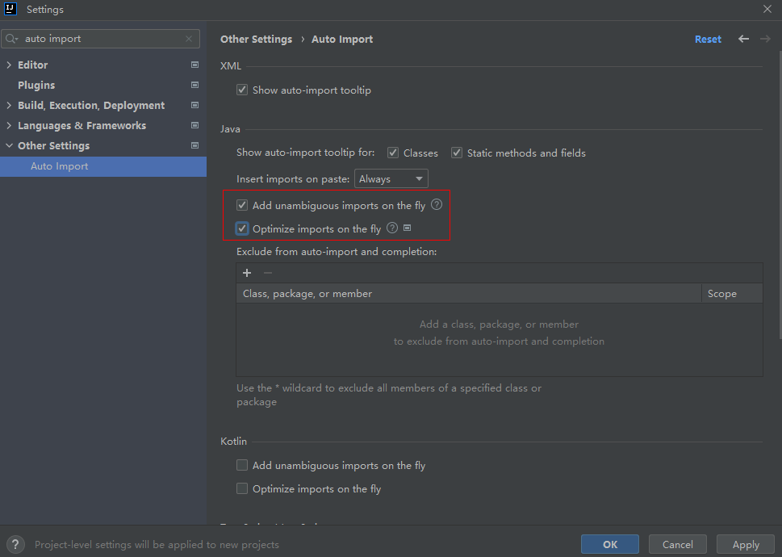

### 自动导入

`File` -> `New Projects Setup` -> `Settings for New Projects...`

---

多人协作开发时，如果不想导包顺序变更，如果取消勾选`Optimize imports on the fly`，目的：减少合并冲突。

`Optimize imports on the fly` 作用：当你输入代码、删除代码或粘贴代码时，IDEA 会自动：

1. 移除未使用的 import（比如你导入了 java.util.List，但没用到它，它会自动删掉）；
2. 按代码风格设置重新排序 import（比如先 java.，再 javax.，然后第三方库，最后项目内部类，按字母顺序排）；
3. 合并重复的 import（比如多次写 import java.util.*，会合并成一次）。
