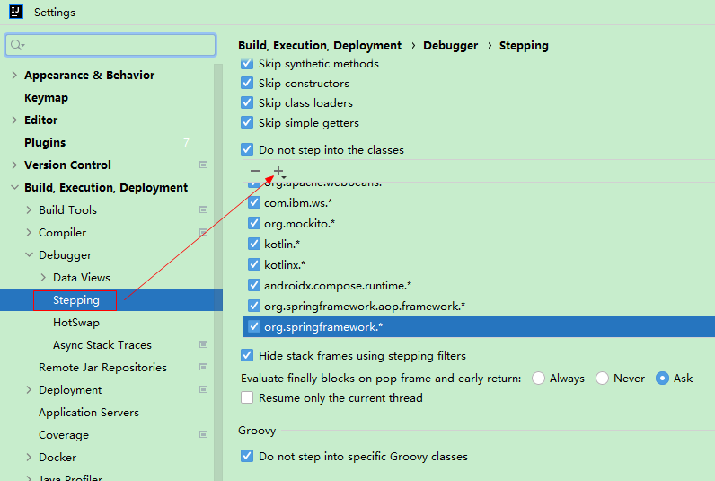

### debug跳过class文件 -- 过滤断点

问题：不配置的情况下每次debug会进入`org.springframework.aop.framework.CglibAopProxy.class`或者其它class文件

解决：如果不想进入一些源码，可以设置过滤断点。 eg: `org.springframework.*`

`File` -> `Settings...` -> `Build,Exclution,Deployment` -> `Debugger` -> `Stepping`

“Do not step into the classes”列表的作用：勾选的包/类会被过滤（调试时不进入）

配置规则：
1. 类名
2. 包名.*

> tips: 如果未生效，看下是否配置了`*.*`，将其取消勾选再测试是否成功跳过。
