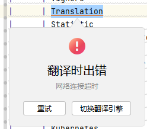
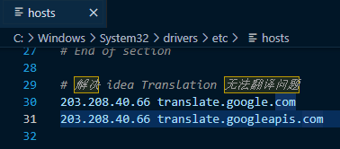
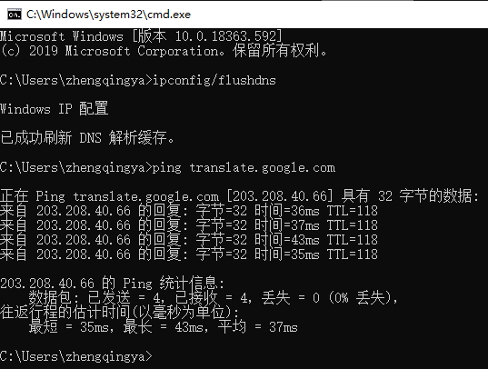
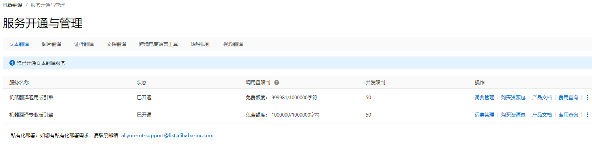
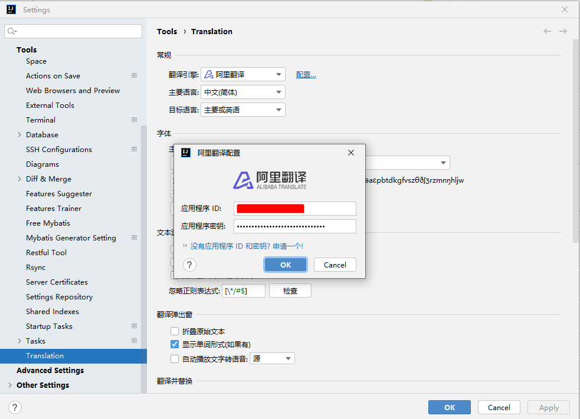
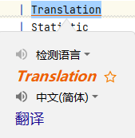
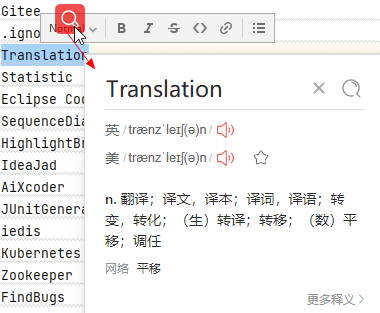

# Translation



### 法一： 修改 `C:\Windows\System32\drivers\etc\hosts`

> tips：可通过 https://github.com/Ponderfly/GoogleTranslateIpCheck 工具扫描国内可用的IP

```shell
# 解决 idea Translation 或谷歌浏览器  无法翻译问题
142.250.4.90 translate.googleapis.com
```



刷新，检验

```shell
ipconfig/flushdns
ping translate.google.com
```



### 法二： 改用阿里翻译

- 开通  https://mt.console.aliyun.com/basic
- 服务开通与管理  https://mt.console.aliyun.com/service
- 查看应用ID与密钥  https://usercenter.console.aliyun.com/#/manage/ak







### 法三： 通过有道划词翻译



