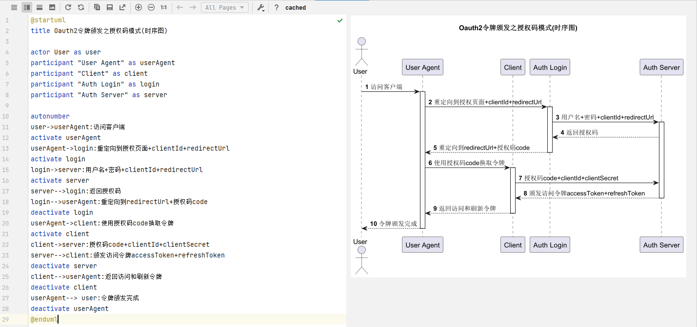
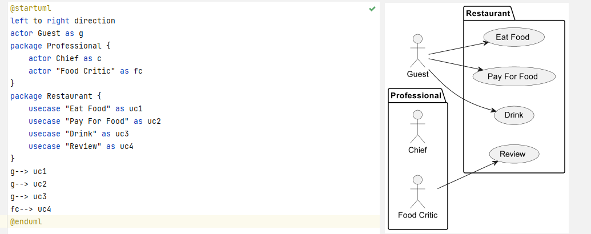
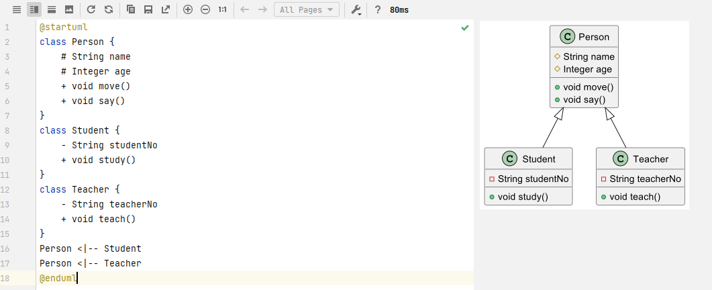
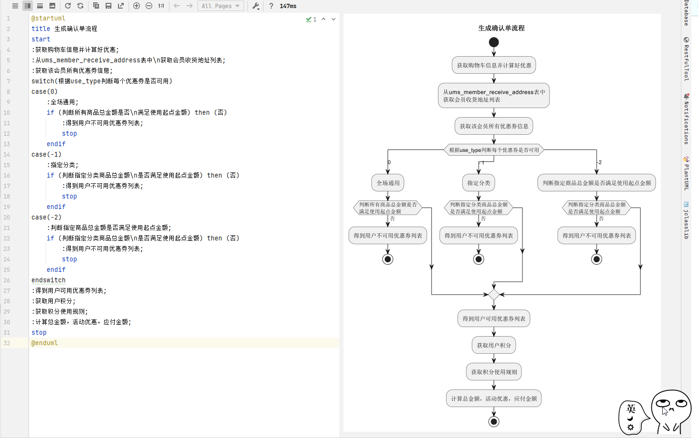

# PlantUML 画图工具

见 https://plantuml.com/zh/

> 参考 https://mp.weixin.qq.com/s/mW275wVLa73wzpmj0XPTaQ

### 时序图

时序图（Sequence Diagram），是一种UML交互图。它通过描述对象之间发送消息的时间顺序显示多个对象之间的动态协作。



[test.puml](test.puml)

```
@startuml
title Oauth2令牌颁发之授权码模式(时序图)

actor User as user
participant "User Agent" as userAgent
participant "Client" as client
participant "Auth Login" as login
participant "Auth Server" as server

autonumber
user->userAgent:访问客户端
activate userAgent
userAgent->login:重定向到授权页面+clientId+redirectUrl
activate login
login->server:用户名+密码+clientId+redirectUrl
activate server
server-->login:返回授权码
login-->userAgent:重定向到redirectUrl+授权码code
deactivate login
userAgent->client:使用授权码code换取令牌
activate client
client->server:授权码code+clientId+clientSecret
server-->client:颁发访问令牌accessToken+refreshToken
deactivate server
client-->userAgent:返回访问和刷新令牌
deactivate client
userAgent--> user:令牌颁发完成
deactivate userAgent
@enduml
```

- `title`可以用于指定UML图的标题；
- 通过`actor`可以声明人形的参与者；
- 通过`participant`可以声明普通类型的参与者；
- 通过`as`可以给参与者取别名；
- 通过`->`可以绘制参与者之间的关系，虚线箭头可以使用`-->`；
- 在每个参与者关系后面，可以使用`:`给关系添加说明；
- 通过`autonumber`我们可以给参与者关系自动添加序号；
- 通过`activate`和`deactivate`可以指定参与者的生命线。

### 用例图

用例图（Usecase Diagram）是用户与系统交互的最简表示形式，展现了用户和与他相关的用例之间的关系。
通过用例图，我们可以很方便地表示出系统中各个角色与用例之间的关系。



- `left to right direction`表示按从左到右的顺序绘制用例图，默认是从上到下；
- 通过`package`可以对角色和用例进行分组；
- 通过`actor`可以定义用户；
- 通过`usecase`可以定义用例；
- 角色和用例之间的关系可以使用`-->`来表示。

### 类图

类图(Class Diagram)可以表示类的静态结构，比如类中包含的属性和方法，还有类的继承结构。



- 通过`class`可以定义类；
- 通过在属性和方法左边加符号可以定义可见性，`-`表示`private`，`#`表示`protected`，`+`表示`public`；
- 通过`<|--`表示类之间的继承关系。

### 活动图

活动图（Activity Diagram）是我们用的比较多的UML图，经常用于表示业务流程，比如电商中的下单流程就可以用它来表示。



- 通过`start`和`stop`可以表示流程的开始和结束；
- 通过`:`和`;`中间添加文字来定义活动流程节点；
- 通过`if`+`then`+`endif`定义条件判断；
- 通过`switch`+`case`+`endswitch`定义switch判断。

### 思维导图

思维导图（Mind Map），是表达发散性思维的有效图形工具，它简单却又很有效，是一种实用性的思维工具。


- 通过`+`和`-`可以表示思维导图中的节点，具有方向性；
- 通过`[#颜色]`可以定义节点的边框颜色；
- 通过`_`可以去除节点的边框；

