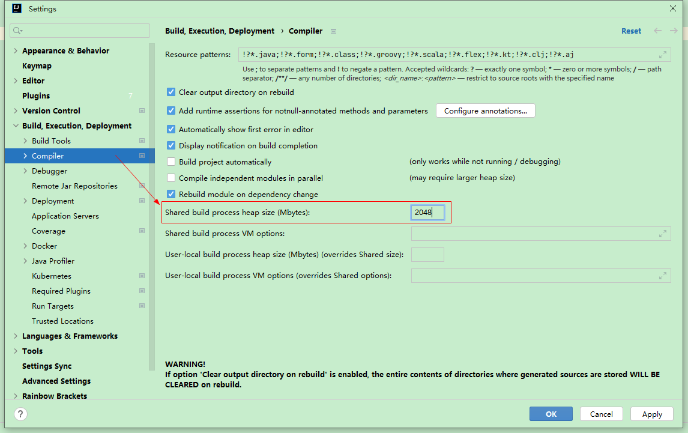

# idea 编译项目时 控制台提示OOM

```shell
java: OutOfMemoryError: insufficient memory
```

解决： 

File -> Settings... -> Build, Execution, Deployment -> Compiler

将`Shared build process heap size（Mbytes）` 调大

> 默认700，根据自己的环境适当调整，我这里升到了2048。


