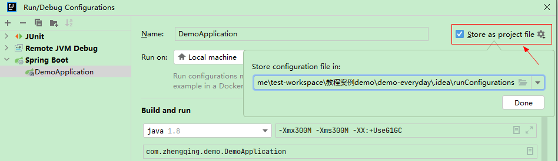
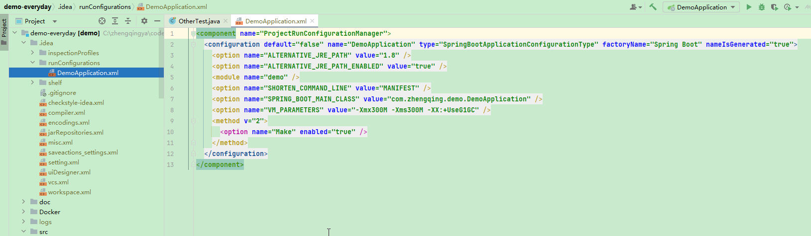

# idea 配置





```xml
<component name="ProjectRunConfigurationManager">
  <configuration default="false" name="DemoApplication" type="SpringBootApplicationConfigurationType" factoryName="Spring Boot" nameIsGenerated="true">
    <option name="ALTERNATIVE_JRE_PATH" value="1.8" />
    <option name="ALTERNATIVE_JRE_PATH_ENABLED" value="true" />
    <module name="demo" />
    <option name="SHORTEN_COMMAND_LINE" value="MANIFEST" />
    <option name="SPRING_BOOT_MAIN_CLASS" value="com.zhengqing.demo.DemoApplication" />
    <option name="VM_PARAMETERS" value="-Xmx300M -Xms300M -XX:+UseG1GC" />
    <method v="2">
      <option name="Make" enabled="true" />
    </method>
  </configuration>
</component>
```

默认会将运行配置存储到文件 `.idea/runConfigurations` 文件夹下。

将此配置文件提交至git管理，确保每次 clone 下来都包含此配置文件，这样下次打开项目时就可以使用这个配置来启动项目了。

适用于团队项目合作，新来的同事可以直接拉取&运行项目。
