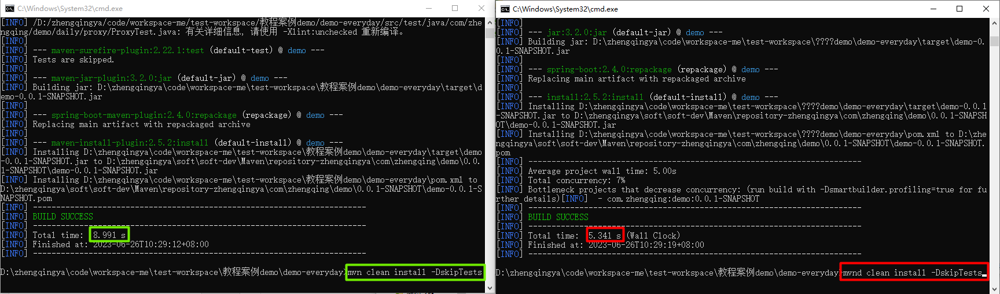

# 安装（windows）

### 一、下载&解压 `maven-mvnd-1.0-m6-m39-windows-amd64.zip`  https://github.com/apache/maven-mvnd/releases

```shell
echo %JAVA_HOME%
mvnd --version
```

### 二、配置环境变量

> `此电脑` -> `属性` -> `高级系统设置` -> `环境变量`

```
# 新建系统环境变量
MAVEN_MVND_HOME -> D:\zhengqingya\soft\soft-dev\Maven\maven-mvnd-1.0-m6-m39-windows-amd64

# 编辑PATH环境变量，新增
%MAVEN_MVND_HOME%\bin

# 验证
mvnd --version
```


### 三、配置使用原先已存在的 maven 的仓库

#### 方式一： 修改配置文件 `maven-mvnd-1.0-m6-m39-windows-amd64\conf\mvnd.properties`

```
maven.settings=D://zhengqingya//soft//soft-dev//Maven//apache-maven-3.8.6//conf//settings.xml
```

#### 方式二： 修改配置文件 `maven-mvnd-1.0-m6-m39-windows-amd64\mvn\conf\settings.xml`

这个就和修改maven里面的`settings.xml`配置一样了...

### 四、构建打包测试

```shell
mvnd -help
# 与 maven 命令几乎没有任何不同
# eg：maven 打包命令
# mvn clean install -DskipTests
# mvnd 打包命令
mvnd clean install -DskipTests
```



`mvnd`打包速度确实比`mvn`快点


