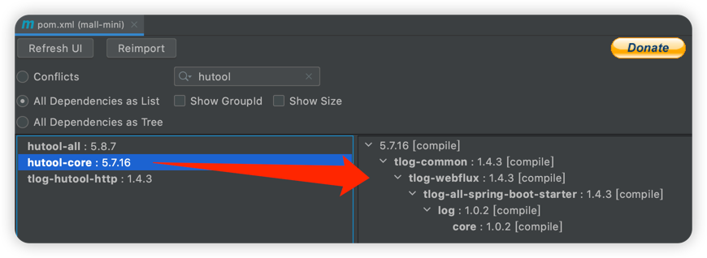
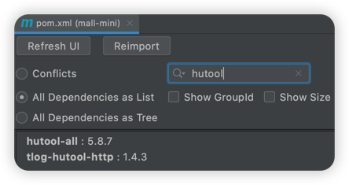

### jar包版本统一管理

#### 1、微服务中父工程`pom.xml`声明某一依赖并指定版本

> `dependencyManagement`中配置依赖并不会实际引入，只是为了版本管理。
> 实际引入需要直接在`dependencies`中添加。

```
<dependencyManagement>
    <dependencies>
        <dependency>
            <groupId>io.seata</groupId>
            <artifactId>seata-spring-boot-starter</artifactId>
            <version>1.5.2</version>
        </dependency>
    </dependencies>
</dependencyManagement>
```

#### 2、子工程`pom.xml`引用依赖，无需再指定版本号，即实现全局统一版本管理

```
<dependencies>
    <dependency>
        <groupId>io.seata</groupId>
        <artifactId>seata-spring-boot-starter</artifactId>
        <!--            <version>1.5.2</version>-->
    </dependency>
</dependencies>
```

### ex: 解决2个jar包中版本不一致导致的问题 -- 统一在全局排除其中依赖，然后在外层全局引入相关依赖指定版本

问题：


下面来解决下

#### 1、父工程

```
<dependencyManagement>
    <dependencies>
        <!-- Hutool工具类 -->
        <!-- https://mvnrepository.com/artifact/cn.hutool/hutool-all -->
        <dependency>
            <groupId>com.yomahub</groupId>
            <artifactId>tlog-all-spring-boot-starter</artifactId>
            <version>1.4.3</version>
            <exclusions>
                <!--
                   解决： cn.hutool.core.util.ObjectUtil.defaultIfNull(Ljava/lang/Object;Ljava/util/function/Supplier;)Ljava/lang/Object;
                   问题原因： log模块中tlog的hutool-core版本不一致
                -->
                <exclusion>
                    <groupId>cn.hutool</groupId>
                    <artifactId>hutool-core</artifactId>
                </exclusion>
            </exclusions>
        </dependency>
    </dependencies>
</dependencyManagement>

<dependencies>
    <!-- Hutool工具类 -->
    <!-- https://mvnrepository.com/artifact/cn.hutool/hutool-all -->
    <dependency>
        <groupId>cn.hutool</groupId>
        <artifactId>hutool-all</artifactId>
        <version>5.8.7</version>
    </dependency>
</dependencies>
```

#### 2、子工程

```
<dependencies>
    <dependency>
        <groupId>com.yomahub</groupId>
        <artifactId>tlog-all-spring-boot-starter</artifactId>
    </dependency>
</dependencies>
```

最终



---

### 当统一管理版本时，依赖过多时，可以`<scope>import</scope>`引入别人封装好的依赖管理

```
<dependencyManagement>
    <dependencies>
        <dependency>
            <groupId>org.springframework.boot</groupId>
            <artifactId>spring-boot-dependencies</artifactId>
            <version>2.7.0</version>
            <type>pom</type>
            <scope>import</scope>
        </dependency>
        <dependency>
            <groupId>org.springframework.cloud</groupId>
            <artifactId>spring-cloud-dependencies</artifactId>
            <version>2021.0.2</version>
            <type>pom</type>
            <scope>import</scope>
        </dependency>
    </dependencies>
</dependencyManagement>
```