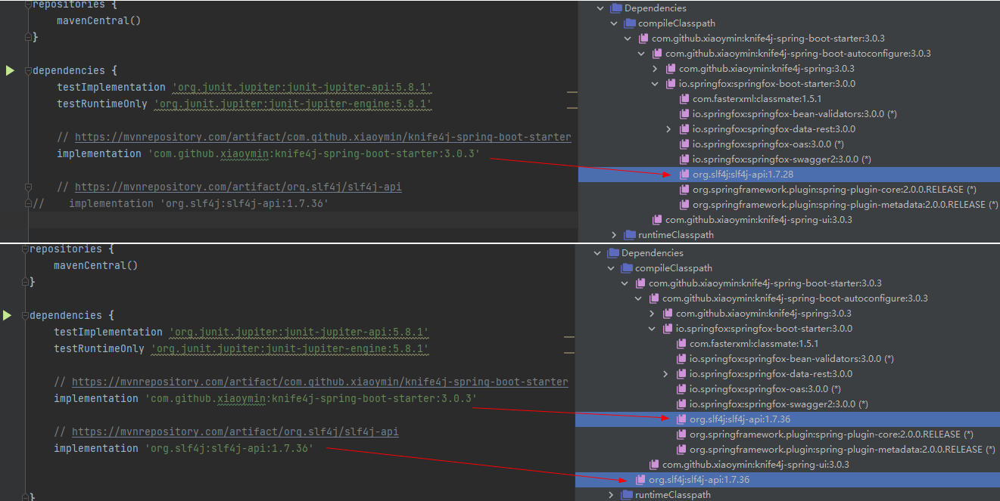
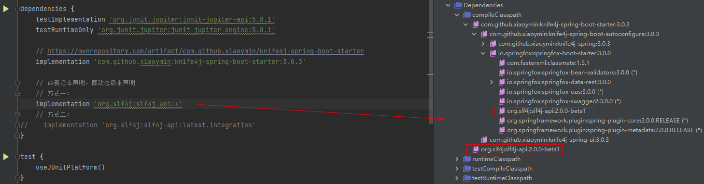

### 法一：gradle默认使用最新版本

当引用同一个依赖不同版本时，gradle会使用最新版本

```
dependencies {
    // https://mvnrepository.com/artifact/com.github.xiaoymin/knife4j-spring-boot-starter
    implementation 'com.github.xiaoymin:knife4j-spring-boot-starter:3.0.3'

    // https://mvnrepository.com/artifact/org.slf4j/slf4j-api
    implementation 'org.slf4j:slf4j-api:1.7.36'
}
```



### 法二：exclude排除依赖

```
dependencies {
    // https://mvnrepository.com/artifact/com.github.xiaoymin/knife4j-spring-boot-starter
    implementation('com.github.xiaoymin:knife4j-spring-boot-starter:3.0.3') {
        // 排除依赖
//        exclude group: 'org.slf4j'
//        exclude module: 'slf4j-api'
        exclude group: 'org.slf4j', module: 'slf4j-api'
    }

    // 上面排除依赖后，这里再手动引用我们要使用的依赖版本
    // https://mvnrepository.com/artifact/org.slf4j/slf4j-api
    implementation 'org.slf4j:slf4j-api:1.7.36'
}
```


### 法三：不允许依赖传递

> 不建议使用

```
dependencies {
    // https://mvnrepository.com/artifact/com.github.xiaoymin/knife4j-spring-boot-starter
    implementation('com.github.xiaoymin:knife4j-spring-boot-starter:3.0.3') {
        // 关闭依赖传递：即内部的所有依赖将不会添加到编译和运行时的类路径。
        transitive(false)
    }

    // https://mvnrepository.com/artifact/org.slf4j/slf4j-api
    implementation 'org.slf4j:slf4j-api:1.7.36'
}
```


### 法四：强制使用指定版本

```
dependencies {
    // https://mvnrepository.com/artifact/com.github.xiaoymin/knife4j-spring-boot-starter
    implementation 'com.github.xiaoymin:knife4j-spring-boot-starter:3.0.3'

    // 强制使用指定版本
    // 方式一：!!
    // https://mvnrepository.com/artifact/org.slf4j/slf4j-api
    implementation 'org.slf4j:slf4j-api:1.6.0!!'

    // 方式二：
//    implementation('org.slf4j:slf4j-api:1.6.0') {
//        version {
//            strictly("1.6.2")
//        }
//    }
}
```


### 其它

#### 配置版本冲突时直接构建失败

```
configurations.all() {
    Configuration configuration ->
        // 版本冲突时直接构建失败
        configuration.resolutionStrategy.failOnVersionConflict()
}
```


#### 动态版本声明

```
dependencies {
    // 最新版本声明，即动态版本声明
    // 方式一：
    implementation 'org.slf4j:slf4j-api:+'
    // 方式二：
//    implementation 'org.slf4j:slf4j-api:latest.integration'
}
```


