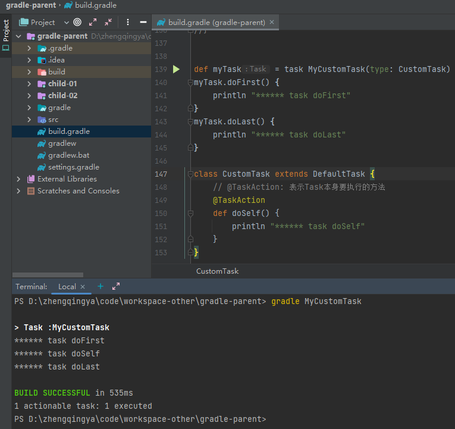

> https://docs.gradle.org/current/dsl/index.html

| 任务类型                 | 作用                                                     |
| ------------------------ | -------------------------------------------------------- |
| Delete                   | 删除文件或目录                                             |
| Copy                     | 将文件复制到目标目录中。此任务还可以在复制时重命名和筛选文件 |
| CreateStartScripts       | 创建启动脚本                                              |
| Exec                     | 执行命令行进程                                             |
| GenerateMavenPom         | 生成 Maven 模块描述符(POM)文件。                            |
| GradleBuild              | 执行 Gradle 构建                                         |
| Jar                      | 组装 JAR 归档文件                                         |
| JavaCompile              | 编译 Java 源文件                                         |
| Javadoc                  | 为 Java 类 生 成 HTML API 文 档                           |
| PublishToMavenRepository | 将 MavenPublication 发布到 mavenartifactrepostal        |
| Tar                      | 组装 TAR 存档文件                                         |
| Test                     | 执行 JUnit (3.8.x、4.x 或 5.x)或 TestNG 测试              |
| Upload                   | 将 Configuration 的构件上传到一组存储库                    |
| War                      | 组装 WAR 档案                                           |
| Zip                      | 组装 ZIP 归档文件。默认是压缩 ZIP 的内容                    |

### 示例

```
// 删除build文件夹
tasks.register('myClean', Delete) {
    delete buildDir
}
```

### 自定义task类型

```
def myTask = task MyCustomTask(type: CustomTask)
myTask.doFirst() {
    println "****** task doFirst"
}
myTask.doLast() {
    println "****** task doLast"
}

class CustomTask extends DefaultTask {
    // @TaskAction: 表示Task本身要执行的方法
    @TaskAction
    def doSelf() {
        println "****** task doSelf"
    }
}
```

